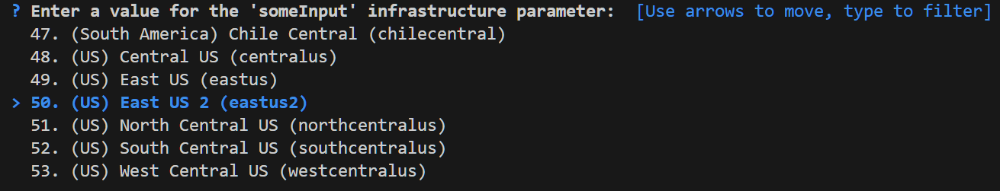
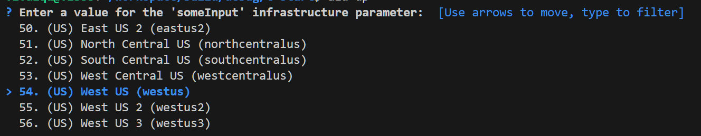
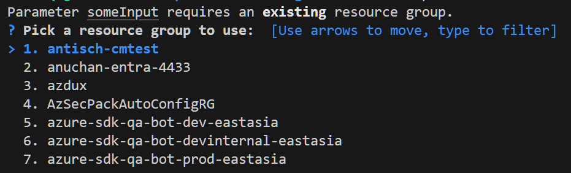
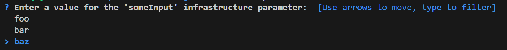

# Azd metadata for bicep input parameters

The Azure Developer CLI can improve the experience for deploying bicep by adding azd-specific `metadata` into input parameters. The metadata becomes transparent for bicep and for the ARM deployment service, but it is recognized by azd to control the prompting for parameters during provision (azd provision).

## Adding metadata

Input parameters in bicep supports [@metadata](https://learn.microsoft.com/azure/azure-resource-manager/bicep/parameters#metadata) as a schema-free object. You can include azd specific metadata by adding the `azd` field to the parameter metadata like:

```bicep
@metadata({
  azd: {}
})
param someInput <param-type>
```

Azd metadata does not depend on the parameter's type. It can be added to any parameter.

## Supported azd metadata

The supported configuration fields for azd metadata are:

  | Field | Description |
  |-------|-------------|
  | type | Defines how azd should prompt for this parameter. Example: `location`. |
  | config | Describes the settings for some of the types, like `generate`. |
  | default | Defines a value for azd to highlight initially during a select prompt. |
  | usageName | Controls quota-check for ai-model location select |

### Type

This configuration defines a unique way for azd to prompt for an input parameter. The supported types are the following:

#### location

Use the type location to signal azd about an input parameter handling an Azure location. When Azd finds the location type in the metadata, it prompts the user for a value using the `select location` list.  Example:

```bicep
@metadata({
  azd: {
    type: 'location'
  }
})
param someInput string
```

Prompting flow:



The `location` type can be combined with the `default` field to control which location should be initially highlighted during the prompt flow. For example:

```bicep
@metadata({
  azd: {
    type: 'location'
    default: 'westus'
  }
})
param someInput string
```

Prompting flow:



Note how the highlighted default option matched the `default` field from the metadata. This is convenient for template authors for recommending a location but letting users to confirm or change it. THis is difference from setting a default value for the input parameter in bicep because that makes azd to skip the prompt flow and to directly use the default value without user confirmation.

#### generate

Use the type `generate` request azd to automatically produce the value for the input parameter. This is typically used to auto-generate passwords. Take a look the the next example:

```bicep
@metadata({
  azd: {
    type: 'generate'
    config: {
      length: 10
    }
  }
})
param someInput string
```

> Note: The `config` field is required when using the `type: 'generate'`

When azd runs, it automatically generates a 10 character value for the input parameter without prompting user to input a value. See the [config](#config) section below to learn more about the options to configure the auto-generation values.

#### resourceGroup

Use the `type: 'resourceGroup` to signal azd that for prompting for this input, it should pick a resource group. Example:

```bicep
@metadata({
  azd: {
    type: 'resourceGroup'
  }
})
param someInput string
```

Prompt flow:



### Config

The config object is required when using the `type: 'generate'`. It controls the auto-generation options. The next table describe the options you can use:

| Field Name | Type | Description | Default |
|------------|------|-------------|---------|
| length | int | Total length of the generated password | 0 |
| noLower | bool | If true, excludes lowercase letters | false |
| noUpper | bool | If true, excludes uppercase letters | false |
| noNumeric | bool | If true, excludes numbers | false |
| noSpecial | bool | If true, excludes special characters | false |
| minLower | int | Minimum number of lowercase letters required | 0 |
| minUpper | int | Minimum number of uppercase letters required | 0 |
| minNumeric | int | Minimum number of numbers required | 0 |
| minSpecial | int | Minimum number of special characters required | 0 |

**Note:** The sum of all minimum requirements (MinLower + MinUpper + MinNumeric + MinSpecial) must not exceed the total Length.
If any "No-" flag is set to true, the corresponding "Min-" value should be 0.

Example: Generate a value with length 10 with no special characters and with no numbers:

```bicep
@metadata({
  azd: {
    type: 'generate'
    config: {
      length: 10
      noNumeric: true
      noSpecial: true
    }
  }
})
param someInput string
```

### default

Defines the initial value from a list to highlight. It can be combined with the `type: 'location'` or it can be directly applied to an input with a defined list of options. For example:

```bicep
@allowed(['foo', 'bar', 'baz'])
@metadata({
  azd: {
    default: 'baz'
  }
})
param someInput string
```

The example uses the `@allowed()` annotation from bicep to define a list of supported values for the input parameter. When azd prompts for this input, it uses the the list of allowed values. Then, the `default` field from the metadata can control which option to set as the initial selection:



### usageName

The `usageName` field defines an `AI-location` filter.  It makes the `type` to be automatically set to `location` (if not defined explicitly) and makes azd to filter and display only those locations where the provided AI-model SKU