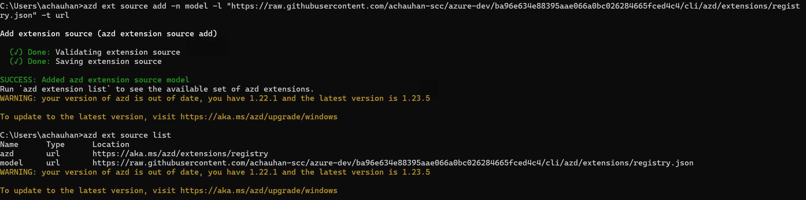
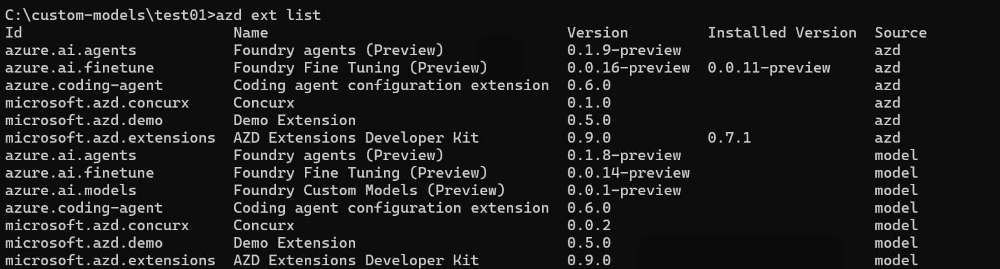
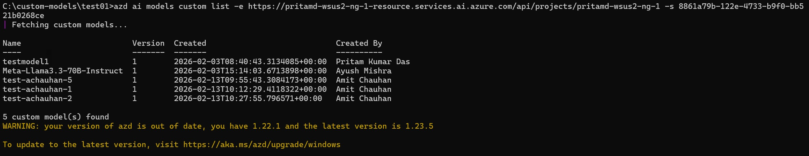
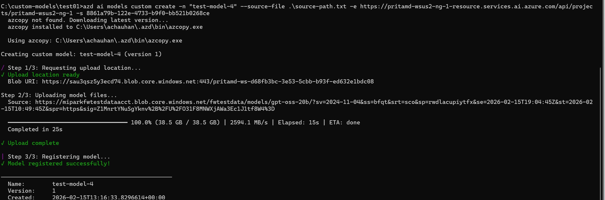
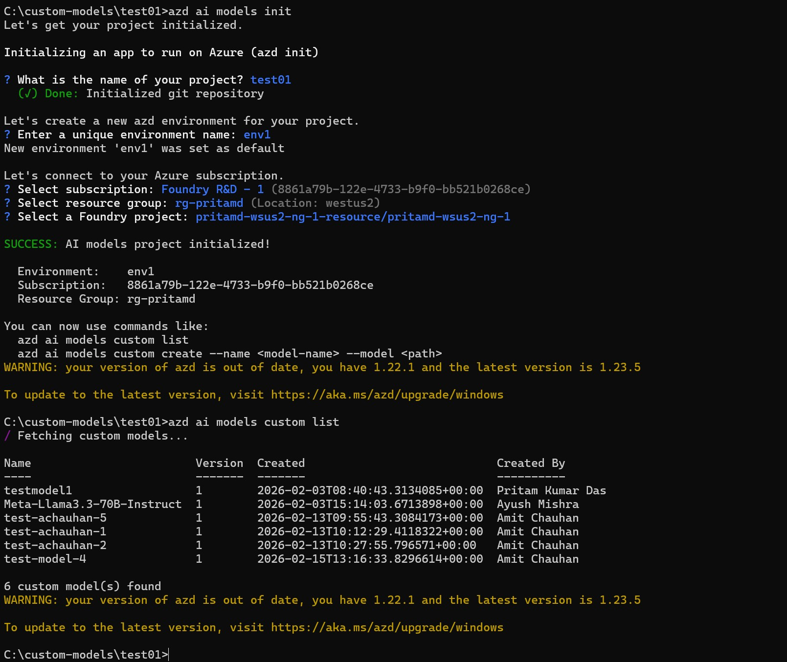

# Azure AI Models Extension — Installation & Usage Guide

## Prerequisites

- An Azure AI Foundry project with a Cognitive Services account
- Azure subscription with appropriate permissions

### Install Azure Developer CLI (azd)

If you don't have `azd` installed, install it via winget:

```powershell
winget install microsoft.azd
```

After installation, restart your terminal and verify:

```bash
azd version
```

For other installation methods, see the [official docs](https://learn.microsoft.com/azure/developer/azure-developer-cli/install-azd).

---

## Step 0: Authenticate with Azure

```bash
azd auth login
```

Sign in with your Azure credentials. This is required for both installing the extension and using it.

---

## Step 1: Add the Extension Source

Add the extension registry that contains the Azure AI Models extension:

```bash
azd ext source add -n model -l "https://raw.githubusercontent.com/achauhan-scc/azure-dev/ba96e634e88395aae066a0bc026284665fced4c4/cli/azd/extensions/registry.json" -t url
```



---

## Step 2: Verify Extension is Available

Confirm the extension appears in the list of available extensions:

```bash
azd ext list
```

You should see `azure.ai.models` in the output.



---

## Step 3: Install the Extension

```bash
azd ext install azure.ai.models
```


---

## Step 4: Verify Installation

```bash
azd ai models -h
```

You should see the help output with available commands: `init`, `custom`, and `version`.


---

## Step 5: Authenticate (if not already done)

Ensure you are logged in before running any model commands:

```bash
azd auth login
```

---

## Step 6: Use Custom Model Commands

You can use the custom model commands by providing `--project-endpoint (-e)` and `--subscription (-s)` flags directly.

### 6.1 List Custom Models

```bash
azd ai models custom list -e <project_endpoint> -s <subscription_id>
```

**Example:**

```bash
azd ai models custom list -e "https://my-account.services.ai.azure.com/api/projects/my-project" -s "8861a79b-1234-5678-abcd-1234567890ab"
```



### 6.2 Create a Custom Model

```bash
azd ai models custom create -e <project_endpoint> -s <subscription_id> --name <model-name> --source <local_path_or_remote_url>
```

**Example with local source:**

```bash
azd ai models custom create -e "https://my-account.services.ai.azure.com/api/projects/my-project" -s "8861a79b-1234-5678-abcd-1234567890ab" --name my-model --source "D:\models\my-weights" --base-model "FW-DeepSeek-v3.1"
```

**Example with remote source:**

> **⚠️ Important:** When using a remote blob URL with a SAS token, the `&` characters in the
> URL are interpreted by the command shell as command separators. You have two options:
>
> **Option A:** Escape each `&` with `^` in cmd.exe:
> ```cmd
> azd ai models custom create --name my-model --source "https://account.blob.core.windows.net/container/path?sv=2026-02-06^&sp=rl^&sig=..."
> ```
>
> **Option B (Recommended):** Save the URL in a file and use `--source-file`:
> ```bash
> echo https://account.blob.core.windows.net/container/path?sv=2026-02-06&sp=rl&sig=... > source_url.txt
> azd ai models custom create --name my-model --source-file source_url.txt
> ```



### 6.3 Show Custom Model Details

```bash
azd ai models custom show -e <project_endpoint> -s <subscription_id> --name <model-name>
```

### 6.4 Delete a Custom Model

```bash
azd ai models custom delete -e <project_endpoint> -s <subscription_id> --name <model-name>
```

Use `--force` to skip the confirmation prompt:

```bash
azd ai models custom delete -e <project_endpoint> -s <subscription_id> --name <model-name> --force
```

---

## Step 7: Initialize Project (Optional — Recommended)

Instead of passing `-e` and `-s` on every command, you can run `azd ai models init` to
configure your project once. This stores the project endpoint and subscription in the
azd environment so all subsequent commands pick them up automatically.

```bash
azd ai models init
```

The init command will interactively guide you through:

1. Creating an azd project (if needed)
2. Creating an azd environment
3. Selecting your Azure subscription
4. Selecting a resource group
5. Selecting your AI Foundry project

After init, you can run commands without `-e` and `-s`:

```bash
azd ai models custom list
azd ai models custom create --name my-model --source ./model-weights/
azd ai models custom show --name my-model
azd ai models custom delete --name my-model
```

You can also provide flags during init to skip interactive prompts:

```bash
azd ai models init -e "https://my-account.services.ai.azure.com/api/projects/my-project" -s "8861a79b-1234-5678-abcd-1234567890ab"
```



---

## Quick Reference

| Command | Description |
|---------|-------------|
| `azd ai models init` | Set up project, environment, and Azure context |
| `azd ai models custom list` | List all custom models |
| `azd ai models custom create --name <n> --source <path>` | Upload and register a model |
| `azd ai models custom show --name <n>` | Show model details |
| `azd ai models custom delete --name <n>` | Delete a model |

### Common Flags

| Flag | Short | Description |
|------|-------|-------------|
| `--project-endpoint` | `-e` | Foundry project endpoint URL |
| `--subscription` | `-s` | Azure subscription ID |
| `--name` | `-n` | Model name |
| `--version` | | Model version (default: "1") |
| `--output` | `-o` | Output format: `table` or `json` |
| `--force` | `-f` | Skip confirmation prompts |
| `--source` | | Local path or remote URL for model files |
| `--source-file` | | File containing the source URL |
| `--base-model` | | Base model architecture tag |
