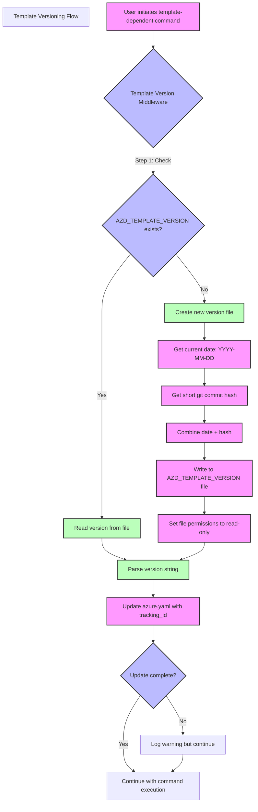

```mermaid
flowchart TD
    title["Template Versioning Flow"]
    
    A[User initiates template-dependent command] --> B{Template Version Middleware}
    
    B -->|Step 1: Check| C{AZD_TEMPLATE_VERSION exists?}
    
    C -->|Yes| D[Read version from file]
    C -->|No| E[Create new version file]
    
    E --> F[Get current date: YYYY-MM-DD]
    F --> G[Get short git commit hash]
    G --> H[Combine date + hash]
    H --> I[Write to AZD_TEMPLATE_VERSION file]
    I --> J[Set file permissions to read-only]
    
    D --> K[Parse version string]
    J --> K
    
    K --> L[Update azure.yaml with tracking_id]
    
    L --> M{Update complete?}
    M -->|Yes| N[Continue with command execution]
    M -->|No| O[Log warning but continue]
    O --> N
    
    classDef process fill:#f9f,stroke:#333,stroke-width:2px;
    classDef decision fill:#bbf,stroke:#333,stroke-width:2px;
    classDef file fill:#bfb,stroke:#333,stroke-width:2px;
    
    class A,F,G,H,I,J,L process;
    class B,C,M decision;
    class D,E,K file;
```
