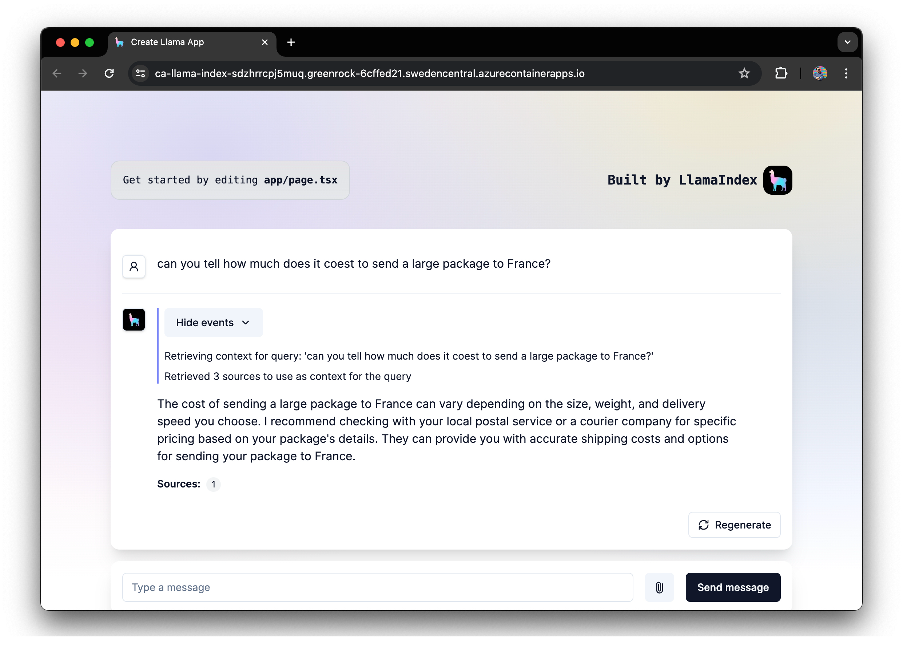
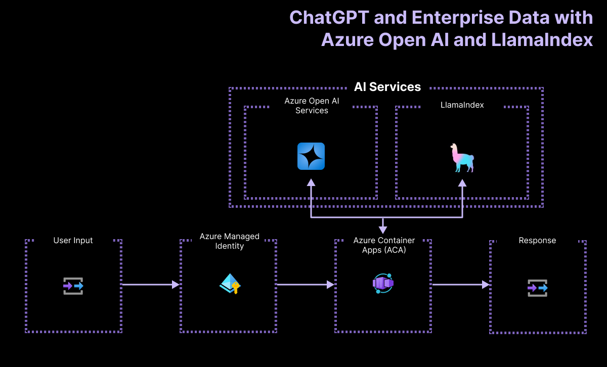

<!--
---
name: Serverless Azure OpenAI Quick Start with LlamaIndex (JavaScript)
description: Build a simple RAG app with LlamaIndex and Azure OpenAI, deployed on Azure Container Apps
languages:
- javascript
- typescript
- nodejs
- bicep
- azdeveloper
products:
- azure-openai
- azure-container-apps
- azure
page_type: sample
urlFragment: llama-index-javascript
---
-->

<div align="center">

# Serverless Azure OpenAI Quick Start with LlamaIndex <br> (JavaScript)

[](https://codespaces.new/Azure-Samples/llama-index-javascript?hide_repo_select=true&ref=main&quickstart=true)
[](https://github.com/Azure-Samples/llama-index-javascript/actions)

[](LICENSE)

This sample shows how to quickly get started with [LlamaIndex for TypeScript](https://ts.llamaindex.ai/) on Azure. The application is hosted on [Azure Container Apps](https://learn.microsoft.com/azure/container-apps/). You can use it as a starting point for building more complex RAG applications.

(Like and fork this sample to receive lastest changes and updates)

[](#features)
[](#architecture-diagram)
[](#getting-started)
[](#guidance)
[](#resources)
[](#troubleshooting)
[](#contributing)
[](#trademarks)
[](LICENSE)
[](https://github.com/Azure-Samples/llama-index-javascript/stargazers)

  

</div>

## Features

This project demonstrates how to build a simple LlamaIndex application using Azure OpenAI. The app is set up as a chat interface that can answer questions about your data. You can add arbitrary data sources to your chat, like local files, websites, or data retrieved from a database. The app will ingest any supported files you put in `./data/` directory. This sample app uses LlamaIndex.TS that is able to ingest any PDF, text, CSV, Markdown, Word and HTML files.

## Architecture Diagram

<div align="center">
  
</div>

This application is built around a single component:

- A full-stack Next.js application that is hosted on [Azure Container Apps](https://learn.microsoft.com/azure/container-apps/) in just a few commands. This app uses [LlamaIndex.TS](https://github.com/run-llama/LlamaIndexTS), a TypeScript library that can ingest any PDF, text, CSV, Markdown, Word and HTML files.

- The app uses [Azure OpenAI](https://learn.microsoft.com/azure/ai-services/openai/overview) to answer questions about the data you provide. The app is set up to use the `gpt-35-turbo` model and embeddings to provide the best and fastest answers to your questions.

## Getting Started

You have a few options for getting started with this template. The quickest way to get started is [GitHub Codespaces](#github-codespaces), since it will setup all the tools for you, but you can also [set it up locally](#local-environment). You can also use a [VS Code dev container](#vs-code-dev-containers)

This template uses `gpt-35-turbo` version `1106`  which may not be available in all Azure regions. Check for [up-to-date region availability](https://learn.microsoft.com/azure/ai-services/openai/concepts/models#standard-deployment-model-availability) and select a region during deployment accordingly

  * We recommend using `swedencentral`

### GitHub Codespaces

You can run this template virtually by using GitHub Codespaces. The button will open a web-based VS Code instance in your browser:

1. Open the template (this may take several minutes)
    [](https://codespaces.new/Azure-Samples/llama-index-javascript?hide_repo_select=true&ref&quickstart=true)
2. Open a terminal window
3. Sign into your Azure account:

    ```shell
     azd auth login
    ```
4. Provision the Azure resources and deploy your code:

    ```shell
     azd up
    ```
5. Install the app dependencies:

    ```bash
     npm install
    ```

### VS Code Dev Containers

A related option is VS Code Dev Containers, which will open the project in your local VS Code using the [Dev Containers extension](https://marketplace.visualstudio.com/items?itemName=ms-vscode-remote.remote-containers):

1. Start Docker Desktop (install it if not already installed)
2. Open the project:
    [](https://vscode.dev/redirect?url=vscode://ms-vscode-remote.remote-containers/cloneInVolume?url=https://github.com/Azure-Samples/llama-index-javascript)
3. In the VS Code window that opens, once the project files show up (this may take several minutes), open a terminal window.
4. Sign into your Azure account:

    ```shell
     azd auth login
    ```
5. Provision the Azure resources and deploy your code:

    ```shell
     azd up
    ```
6. Install the app dependencies:

    ```bash
     npm install
    ```
7. Configure a CI/CD pipeline:

    ```shell
    azd pipeline config
    ```

To start the web app, run the following command:

```bash
npm run dev
```

Open the URL `http://localhost:3000` in your browser to interact with the bot.

### Local Environment

#### Prerequisites

You need to install following tools to work on your local machine:

- [Docker](https://docs.docker.com/get-docker)
- [Node.js LTS](https://nodejs.org/download/)
- [Azure Developer CLI](https://aka.ms/azure-dev/install)
- [Git](https://git-scm.com/downloads)
- [PowerShell 7+](https://github.com/powershell/powershell) _(for Windows users only)_
  - **Important**: Ensure you can run `pwsh.exe` from a PowerShell command. If this fails, you likely need to upgrade PowerShell.
  - Instead of Powershell, you can also use Git Bash or WSL to run the Azure Developer CLI commands.
- This template uses `gpt-35-turbo` version `1106` which may not be available in all Azure regions. Check for [up-to-date region availability](https://learn.microsoft.com/azure/ai-services/openai/concepts/models#standard-deployment-model-availability) and select a region during deployment accordingly
  * We recommend using `swedencentral`

Then you can get the project code:

1. [**Fork**](https://github.com/Azure-Samples/llama-index-javascript/fork) the project to create your own copy of this repository.
2. On your forked repository, select the **Code** button, then the **Local** tab, and copy the URL of your forked repository.
3. Open a terminal and run this command to clone the repo: <code> git clone &lt;your-repo-url&gt; </code>

#### Quickstart (with Azure OpenAI models)

1. Bring down the template code:

    ```shell
    azd init --template llama-index-javascript
    ```

    This will perform a git clone

2. Sign into your Azure account:

    ```shell
     azd auth login
    ```

3. Install all dependencies:

    ```bash
     npm install
    ```
4. Provision and deploy the project to Azure:

    ```shell
    azd up
    ```
4. Configure a CI/CD pipeline:

    ```shell
    azd pipeline config
    ```

Once your deployment is complete, you should see a `.env` file at the root of the project. This file contains the environment variables needed to run the application using Azure resources.

#### Local Development

To run the sample, run the following commands, which will start the Next.js app.

1. Open a terminal and navigate to the root of the project, then run app:

    ```bash
     npm run dev

Open the URL `http://localhost:3000` in your browser to interact with the Assistant.

## Guidance

### Region Availability

This template uses `gpt-35-turbo` version `1106` which may not be available in all Azure regions. Check for [up-to-date region availability](https://learn.microsoft.com/azure/ai-services/openai/concepts/models#standard-deployment-model-availability) and select a region during deployment accordingly
  * We recommend using `swedencentral`

### Costs

Pricing varies per region and usage, so it isn't possible to predict exact costs for your usage.
However, you can use the [Azure pricing calculator](https://azure.com/e/bf51ef20b57a4da08e47511938ad5415) for the resources below to get an estimate.

- Azure Container Apps: Consumption plan, Free for the first 2M executions. Pricing per execution and memory used. [Pricing](https://azure.microsoft.com/en-us/pricing/details/container-apps/)
- Azure OpenAI: Standard tier, GPT and Ada models. Pricing per 1K tokens used, and at least 1K tokens are used per question. [Pricing](https://azure.microsoft.com/pricing/details/cognitive-services/openai-service/)

> [!WARNING]
> To avoid unnecessary costs, remember to take down your app if it's no longer in use, either by deleting the resource group in the Portal or running `azd down --purge`.

### Security

> [!NOTE]
> When implementing this template please specify whether the template uses Managed Identity or Key Vault

This template has either [Managed Identity](https://learn.microsoft.com/entra/identity/managed-identities-azure-resources/overview) or Key Vault built in to eliminate the need for developers to manage these credentials. Applications can use managed identities to obtain Microsoft Entra tokens without having to manage any credentials. Additionally, we have added a [GitHub Action tool](https://github.com/microsoft/security-devops-action) that scans the infrastructure-as-code files and generates a report containing any detected issues. To ensure best practices in your repo we recommend anyone creating solutions based on our templates ensure that the [Github secret scanning](https://docs.github.com/code-security/secret-scanning/about-secret-scanning) setting is enabled in your repos.


## Resources

Here are some resources to learn more about the technologies used in this sample:

- [LlamaIndexTS Documentation](https://ts.llamaindex.ai) - learn about LlamaIndex (Typescript features).
- [Generative AI For Beginners](https://github.com/microsoft/generative-ai-for-beginners)
- [Azure OpenAI Service](https://learn.microsoft.com/azure/ai-services/openai/overview)
- [Azure OpenAI Assistant Builder](https://github.com/Azure-Samples/azure-openai-assistant-builder)
- [Chat + Enterprise data with Azure OpenAI and Azure AI Search](https://github.com/Azure-Samples/azure-search-openai-javascript)

You can also find [more Azure AI samples here](https://github.com/Azure-Samples/azureai-samples).

## Troubleshooting

If you can't find a solution to your problem, please [open an issue](https://github.com/Azure-Samples/llama-index-javascript/issues) in this repository.

## Contributing

This project welcomes contributions and suggestions. Most contributions require you to agree to a
Contributor License Agreement (CLA) declaring that you have the right to, and actually do, grant us
the rights to use your contribution. For details, visit https://cla.opensource.microsoft.com.

When you submit a pull request, a CLA bot will automatically determine whether you need to provide
a CLA and decorate the PR appropriately (e.g., status check, comment). Simply follow the instructions
provided by the bot. You will only need to do this once across all repos using our CLA.

This project has adopted the [Microsoft Open Source Code of Conduct](https://opensource.microsoft.com/codeofconduct/).
For more information see the [Code of Conduct FAQ](https://opensource.microsoft.com/codeofconduct/faq/) or
contact [opencode@microsoft.com](mailto:opencode@microsoft.com) with any additional questions or comments.

## Trademarks

This project may contain trademarks or logos for projects, products, or services. Authorized use of Microsoft
trademarks or logos is subject to and must follow
[Microsoft's Trademark & Brand Guidelines](https://www.microsoft.com/legal/intellectualproperty/trademarks/usage/general).
Use of Microsoft trademarks or logos in modified versions of this project must not cause confusion or imply Microsoft sponsorship.
Any use of third-party trademarks or logos are subject to those third-party's policies.
