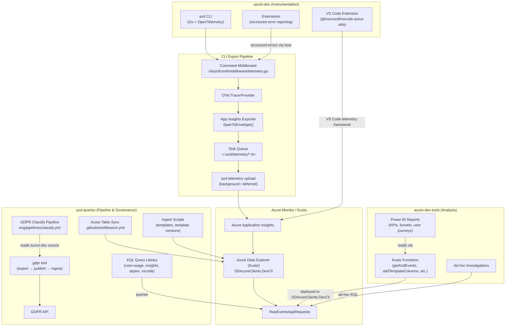
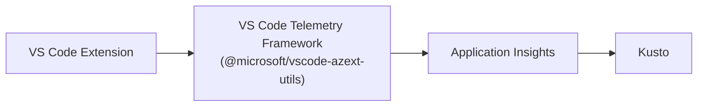
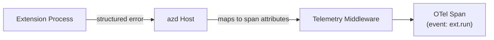
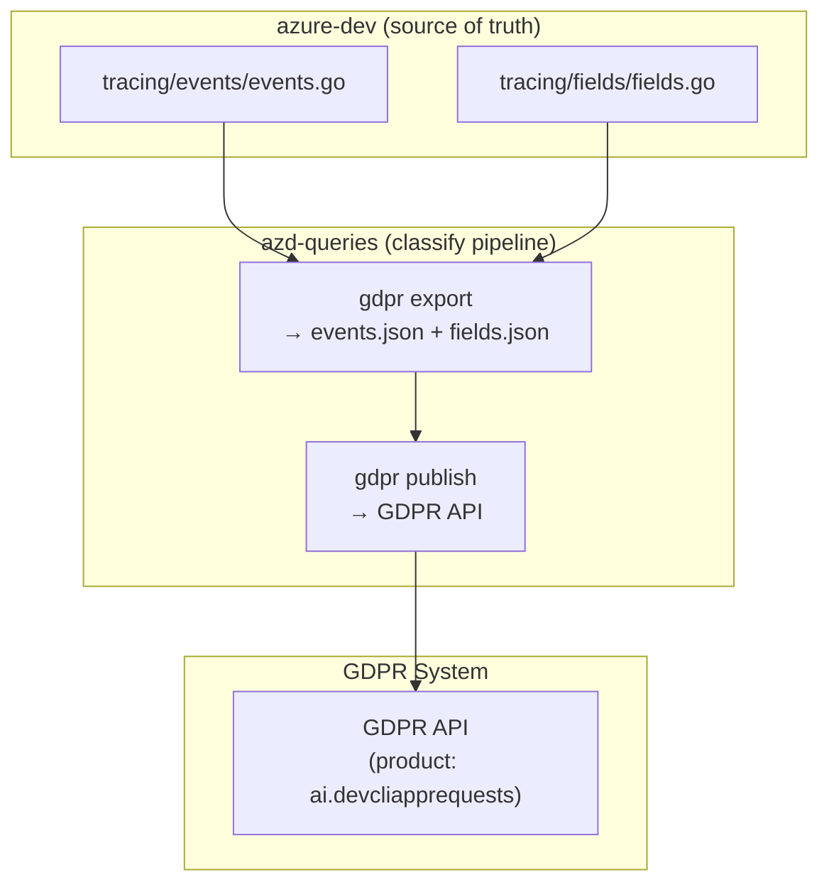

# Azure Developer CLI — Telemetry Architecture

> End-to-end reference for how telemetry flows through the azd ecosystem.
>


## Overview

azd telemetry spans three repositories, each owning a distinct layer:

| Repository | Layer | What It Does |
|-----------|-------|-------------|
| [`Azure/azure-dev`](https://github.com/Azure/azure-dev) | **Instrumentation** | CLI + VS Code extension + extension framework emit OpenTelemetry spans |
| [`devdiv-azure-service-dmitryr/azd-queries`](https://github.com/devdiv-azure-service-dmitryr/azd-queries) | **Pipeline & Governance** | GDPR classification, Kusto table sync, KQL query library |
| [`coreai-microsoft/azure-dev-tools`](https://github.com/coreai-microsoft/azure-dev-tools) → `product-telemetry/azd/` | **Analysis** | Power BI reports, Kusto functions, funnel metrics, investigations |

## End-to-End Data Flow



## CLI Telemetry Pipeline (Detail)

### 1. Initialization

**File:** `cli/azd/internal/telemetry/telemetry.go`

When `azd` starts, the telemetry subsystem:

1. Checks `AZURE_DEV_COLLECT_TELEMETRY` — if set to `"no"`, telemetry is disabled entirely
2. In Cloud Shell, shows a first-run consent notice (creates `~/.azd/first-run` marker)
3. Creates a `StorageQueue` backed by the filesystem at `~/.azd/telemetry/`
4. Initializes the **App Insights Exporter** — a custom OTel `SpanExporter` that converts spans to Application Insights envelopes
5. Optionally adds:
   - Stdout trace exporter (via `--trace-log-file`)
   - OTLP HTTP exporter (via `--trace-log-url`)
6. Creates an OTel `TracerProvider` with the configured exporters
7. Registers the provider globally via `otel.SetTracerProvider(tp)`

### 2. Command Execution → Span Creation

**File:** `cli/azd/cmd/middleware/telemetry.go`

Every azd command is wrapped by the telemetry middleware:

```
user runs `azd deploy`
  → middleware.Run()
    → tracing.Start(ctx, "cmd.deploy")  // creates OTel span
    → records attributes:
        cmd.entry, cmd.flags, cmd.args.count,
        platform.type, installed extensions (id@version)
    → runs the actual command action
    → on completion:
        adds usage attributes (from baggage)
        adds perf.interact_time
        maps errors via cmd.MapError()
    → span.End()
```

For **extension commands**, the event name switches to `ext.run` and records `ext.id`, `ext.version`.

### 3. Span Export → Disk Queue

**File:** `cli/azd/internal/telemetry/storage_exporter.go`

The custom exporter:

1. Receives completed OTel spans
2. Converts each to an Application Insights `Envelope` with `RequestData` (via `SpanToEnvelope()`)
3. Serializes as NDJSON
4. Enqueues to the disk queue (`~/.azd/telemetry/YYYYMMDDThhmmss_retry_random.trn`)
5. Retries enqueue up to 3 times on failure

### 4. Disk Queue → Upload

**Files:** `cli/azd/internal/telemetry/storage.go`, `uploader.go`

The disk queue is a FIFO queue implemented as timestamped files:

- `Peek()` picks the oldest ready item (not older than `itemFileMaxTimeKept`)
- `Cleanup()` removes stale `.tmp` files and expired items

Upload happens via `azd telemetry upload` (triggered as a background subprocess):

1. Acquires `upload.lock` (file lock)
2. Loops: `Peek → Transmit → Remove`
3. Retries up to `maxRetryCount=3` with backoff
4. Handles partial success and `Retry-After` headers from App Insights ingestion

### 5. App Insights Envelope Format

**File:** `cli/azd/internal/telemetry/appinsights-exporter/span_to_envelope.go`

Each span becomes a `contracts.Envelope` containing `RequestData`:

| Envelope Field | Source |
|---------------|--------|
| `IKey` | Instrumentation key from connection string |
| `Tags[ai.application.ver]` | `service.version` resource attribute |
| `Tags[ai.user.*]` | `UserAccountId`, `UserAuthUserId`, `UserId`, `SessionId` |
| `Properties` | String/bool span attributes |
| `Measurements` | Int64/float64 span attributes |
| `Name` | Span name (e.g., `cmd.deploy`) |
| `Duration` | Span duration (App Insights format) |
| `ResponseCode` | Span status / result code |
| `Success` | Span status == OK |

Slice attributes are JSON-serialized into `Properties`.

### 6. Ingestion → Kusto

Envelopes are POSTed (gzip compressed) to the App Insights ingestion endpoint. From there, data flows into Azure Data Explorer:

- **Cluster:** `DDAzureClients`
- **Database:** `DevCli`
- **Primary table:** `RawEventsAppRequests`

## VS Code Extension Telemetry

**Files:** `ext/vscode/src/telemetry/`

The VS Code extension uses a **separate telemetry path** from the CLI:



**Key differences from CLI:**

| Aspect | CLI | VS Code Extension |
|--------|-----|-------------------|
| Framework | Go + OpenTelemetry | TypeScript + vscode-azext-utils |
| Export | Custom App Insights exporter + disk queue | VS Code telemetry framework (direct) |
| Opt-out | `AZURE_DEV_COLLECT_TELEMETRY=no` | `telemetry.telemetryLevel=off` in VS Code settings |
| Events | `cmd.*`, `ext.*`, `mcp.*`, etc. | `azure-dev.*` (activate, deactivate, tasks, surveys) |

**Extension events** (`ext/vscode/src/telemetry/telemetryId.ts`):

- Lifecycle: `azure-dev.activate`, `azure-dev.deactivate`
- CLI command tasks: `deploy`, `provision`, `up`, `down`, `init`, `login`, `restore`, `package`
- Environment/extension actions
- Survey tracking: `azure-dev.survey-check`, `azure-dev.survey-prompt-response`
- Activity statistics: tracks `totalActiveDays` via VS Code Memento storage

## Extension Framework Telemetry

**File:** `cli/azd/cmd/middleware/telemetry.go` (host side), `cli/azd/docs/extensions/extension-framework.md`

Extensions run as separate processes and report back to the azd host:



- Extension commands emit `ext.run` events with `ext.id` and `ext.version`
- Extensions can report **structured errors** back to the host via `ExtensionService.ReportError`
- Error result codes follow conventions:
  - Service errors: `ext.service.<service>.<statusCode>`
  - Validation: `ext.validation.*`
  - Auth: `ext.auth.*`
  - Dependency: `ext.dependency.*`
- Extension lifecycle events: `ext.install`, `ext.upgrade`, `ext.promote`

## GDPR Classification Pipeline

**Repo:** `azd-queries` → `eng/pipelines/classify.yml`

This pipeline ensures all telemetry fields are properly classified for GDPR compliance:



**How it works:**

1. The pipeline checks out **both** `azd-queries` and `Azure/azure-dev`
2. Builds the `gdpr` Go tool (`eng/tools/gdpr/`)
3. Runs `gdpr export` — parses `events.go` and `fields/` to produce `events.json` and `fields.json`
4. Runs `gdpr publish` — pushes metadata to the GDPR API under product code `ai.devcliapprequests`
5. Runs on a schedule for production/staging environments

**GDPR tool commands:**
- `export` — extract event/field metadata from Go source
- `publish` — push metadata to GDPR API
- `ingest` — ingest metadata into Kusto
- `delete` — retire/remove fields from classification

## Consent & Privacy

### Opt-Out

| Surface | Mechanism |
|---------|-----------|
| CLI | Set `AZURE_DEV_COLLECT_TELEMETRY=no` |
| VS Code | Set `telemetry.telemetryLevel` to `off` in VS Code settings |
| Cloud Shell | First-run notice shown; opt-out instructions provided |

### PII Protection

- **Hashed fields:** `project.template.id`, `project.template.version`, `project.name`, `env.name` are SHA-256 hashed (case-insensitive) before emission
- **Data classifications** are annotated on every field:
  - `PublicPersonalData`
  - `SystemMetadata`
  - `CallstackOrException`
  - `CustomerContent`
  - `EndUserPseudonymizedInformation`
  - `OrganizationalIdentifiableInformation`
- **Privacy review required** for: new telemetry fields, classification changes, any unhashed PII (see `docs/specs/metrics-audit/privacy-review-checklist.md`)

## Kusto Table Sync & Ingestion

**Repo:** `azd-queries` → `.github/workflows/ci.yml`

- On PRs: `./ksd build tables` (validates table definitions)
- On merge: `./ksd sync tables` (publishes table definitions to Kusto)
- Ingestion scripts run to sync template metadata:
  - `ingest/ingest-templates.kql`
  - `ingest/ingest-template-versions.kql`
- Template metadata is updated via `eng/Update-Templates.ps1` before ingest

## Key Files Reference

### azure-dev (Instrumentation)
```
cli/azd/
├── cmd/middleware/telemetry.go           # Command-level span middleware
├── internal/
│   ├── telemetry/
│   │   ├── telemetry.go                  # Pipeline init, env vars, consent
│   │   ├── storage.go                    # Disk queue (FIFO)
│   │   ├── storage_exporter.go           # OTel exporter → disk queue
│   │   ├── uploader.go                   # Queue → App Insights upload
│   │   ├── notice.go                     # First-run consent notice
│   │   └── appinsights-exporter/
│   │       ├── span_to_envelope.go       # Span → App Insights envelope
│   │       ├── transmitter.go            # HTTP POST to ingestion
│   │       ├── endpoint_config.go        # Connection string parsing
│   │       └── transmit_payload.go       # NDJSON serialization
│   └── tracing/
│       ├── tracing.go                    # Global tracer
│       ├── attributes.go                 # Global/usage baggage
│       ├── events/events.go              # All event name constants
│       └── fields/
│           ├── fields.go                 # All field keys + classifications
│           └── key.go                    # SHA-256 hashing helpers
ext/vscode/src/telemetry/
├── telemetryId.ts                        # Extension event IDs
└── activityStatisticsService.ts          # Active days tracking
docs/specs/metrics-audit/
├── telemetry-schema.md                   # Canonical schema reference
└── privacy-review-checklist.md           # Privacy review process
```

### azd-queries (Pipeline & Governance)
```
eng/
├── pipelines/classify.yml                # GDPR classification pipeline
└── tools/gdpr/
    ├── README.md                         # Tool documentation
    ├── cmd/                              # export, publish, ingest, delete
    └── pkg/gdpr/convert.go              # Event/field → GDPR row conversion
.github/workflows/
├── ci.yml                                # Kusto table sync + ingest
└── amplitude-export.yml                  # Kusto → Amplitude export
core-usage/                               # MAU/MEU/MDU, funnels, retention KQL
insights-and-segments/                    # Usage by language, template, errors KQL
tables/                                   # Kusto table definitions
ingest/                                   # Template ingestion scripts
```

### azure-dev-tools (Analysis)
```
product-telemetry/azd/
├── Kusto/
│   ├── Functions/                        # Deployed Kusto functions (getAzdEvents, etc.)
│   ├── KPIs/                             # KPI seed queries
│   ├── funnel-metrics/                   # Funnel framework + queries
│   ├── Backfill/                         # Historical backfill scripts
│   └── Investigations/                   # Ad-hoc deep dives
├── PowerBI/                              # Power BI report projects
│   ├── KPIs/
│   ├── User Journeys/
│   ├── Template Health/
│   ├── Deploy and Provision/
│   └── ...
├── Reports/                              # Written analyses (markdown, KQLX)
└── PPTs/                                 # Presentations
```

## See Also

- [Feature Telemetry Guide](../guides/feature-telemetry.md) — How to add telemetry for new features
- [Telemetry Data Reference](../reference/telemetry-data.md) — Schema, events, fields, query patterns
- [Dashboards & Reports](../reference/telemetry-dashboards.md) — Power BI, Kusto functions, funnel metrics
- [Telemetry Overview](../guides/telemetry-overview.md) — For product managers and leadership
