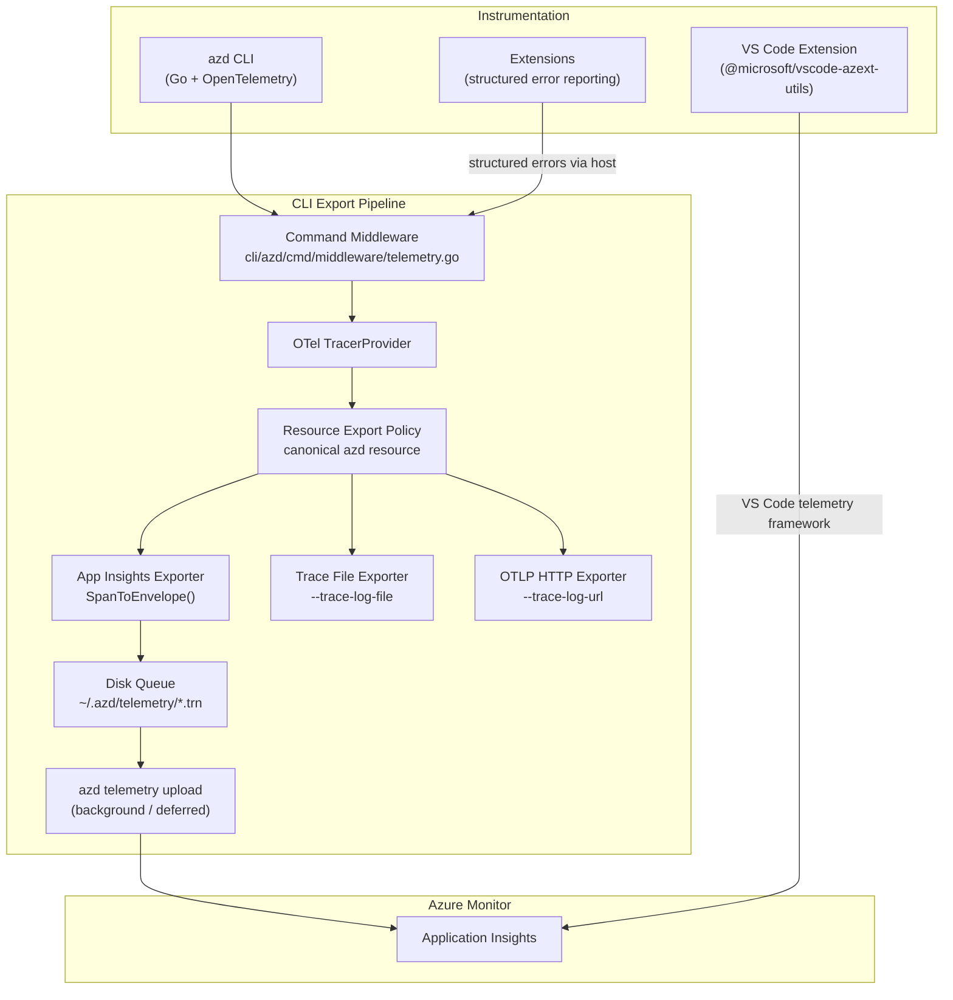
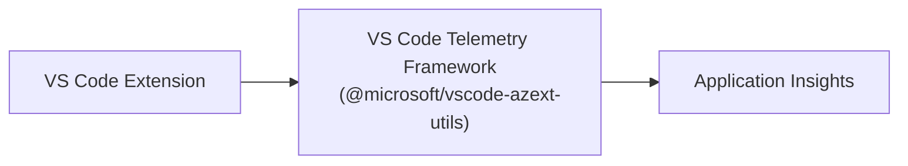
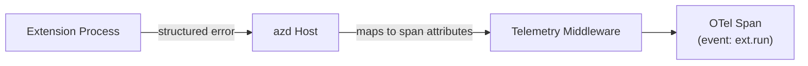

# Azure Developer CLI — Telemetry Architecture

> How azd collects, exports, and transmits telemetry data.

> [!NOTE]
> This is the **public** telemetry documentation. A Microsoft-internal companion set of docs
> (data pipeline, Kusto/Power BI reporting, runnable queries) is maintained separately for
> internal maintainers. 

## Overview

azd emits OpenTelemetry spans for every command execution. Telemetry flows through a local pipeline:

1. **Instrumentation** — CLI, VS Code extension, and extensions emit OTel spans
2. **Export** — Span resources are canonicalized, then spans are converted to Application Insights envelopes and queued
   to disk
3. **Upload** — A background process transmits envelopes to Application Insights

> Microsoft-internal dashboards, data pipelines, and reporting infrastructure are documented separately for internal maintainers.

## Data Flow


```mermaid
flowchart TB
    subgraph Instrumentation ["Instrumentation"]
        CLI["azd CLI<br/>(Go + OpenTelemetry)"]
        VSC["VS Code Extension<br/>(@microsoft/vscode-azext-utils)"]
        EXT["Extensions<br/>(structured error reporting)"]
    end

    subgraph Export ["CLI Export Pipeline"]
        MW["Command Middleware<br/>cli/azd/cmd/middleware/telemetry.go"]
        OTel["OTel TracerProvider"]
        Policy["Resource Export Policy<br/>canonical azd resource"]
        AIExp["App Insights Exporter<br/>SpanToEnvelope()"]
        FileExp["Trace File Exporter<br/>--trace-log-file"]
        OTLPExp["OTLP HTTP Exporter<br/>--trace-log-url"]
        DiskQ["Disk Queue<br/>~/.azd/telemetry/*.trn"]
        Upload["azd telemetry upload<br/>(background / deferred)"]
    end

    subgraph Ingestion ["Azure Monitor"]
        AppInsights["Application Insights"]
    end

    CLI --> MW --> OTel --> Policy
    Policy --> AIExp --> DiskQ --> Upload --> AppInsights
    Policy --> FileExp
    Policy --> OTLPExp
    VSC -->|VS Code telemetry framework| AppInsights
    EXT -->|structured errors via host| MW
```

## CLI Telemetry Pipeline (Detail)

### 1. Initialization

**File:** `cli/azd/internal/telemetry/telemetry.go`

When `azd` starts, the telemetry subsystem:

1. Checks `AZURE_DEV_COLLECT_TELEMETRY` — if set to `"no"`, telemetry is disabled entirely
2. In Cloud Shell, shows a first-run consent notice (creates `~/.azd/first-run` marker)
3. Creates a `StorageQueue` backed by the filesystem at `~/.azd/telemetry/`
4. Constructs the canonical azd resource from declared application fields and OpenTelemetry SDK metadata
5. Initializes the **App Insights Exporter** — a custom OTel `SpanExporter` that converts spans to Application Insights envelopes
6. Optionally adds:
   - Stdout trace exporter (via `--trace-log-file`)
   - OTLP HTTP exporter (via `--trace-log-url`)
7. Wraps every exporter so provider-injected environment attributes are not included in exported span resources
8. Creates an OTel `TracerProvider` with the configured exporters
9. Registers the provider globally via `otel.SetTracerProvider(tp)`

### Exported Resource Policy

OpenTelemetry's Go SDK reads `OTEL_RESOURCE_ATTRIBUTES` and `OTEL_SERVICE_NAME` when a resource is attached to a
`TracerProvider`. azd therefore enforces its resource policy again at the export boundary rather than relying only on
resource construction.

For newly generated spans, the Application Insights queue, `--trace-log-file`, and `--trace-log-url` receive the same
canonical resource:

- The ten azd application fields documented in the [telemetry data reference](../reference/telemetry-data.md)
- `telemetry.sdk.name`, `telemetry.sdk.language`, and `telemetry.sdk.version`

Ambient resource attributes are omitted, including a customer-supplied `service.name` or `service.instance.id`. Span
attributes are not filtered by this boundary, so declared core fields and first-party extension `ext.*` usage
attributes keep their existing behavior. The embedded SDK may still parse the environment variables internally; the
guarantee is that their values are not included in resources exported by azd.

This policy applies when spans are generated. Telemetry envelopes already serialized to the disk queue by an older
azd version are not rewritten.

### 2. Command Execution → Span Creation

**File:** `cli/azd/cmd/middleware/telemetry.go`

Every azd command is wrapped by the telemetry middleware:

```
user runs `azd deploy`
  → middleware.Run()
    → tracing.Start(ctx, "cmd.deploy")  // creates OTel span
    → records attributes:
        cmd.entry, cmd.flags, cmd.args.count,
        platform.type, installed extensions (id@version)
    → runs the actual command action
    → on completion:
        adds usage attributes (from baggage)
        adds perf.interact_time
        maps errors via cmd.MapError()
    → span.End()
```

For **extension commands**, the event name switches to `ext.run` and records `ext.id`, `ext.version`.

### 3. Span Export → Disk Queue

**File:** `cli/azd/internal/telemetry/storage_exporter.go`

The custom exporter:

1. Receives completed OTel spans
2. Converts each to an Application Insights `Envelope` with `RequestData` (via `SpanToEnvelope()`)
3. Serializes as NDJSON
4. Enqueues to the disk queue (`~/.azd/telemetry/YYYYMMDDThhmmss_retry_random.trn`)
5. Retries enqueue up to 3 times on failure

### 4. Disk Queue → Upload

**Files:** `cli/azd/internal/telemetry/storage.go`, `uploader.go`

The disk queue is a FIFO queue implemented as timestamped files:

- `Peek()` picks the oldest ready item (not older than `itemFileMaxTimeKept`)
- `Cleanup()` removes stale `.tmp` files and expired items

Upload happens via `azd telemetry upload` (triggered as a background subprocess):

1. Acquires `upload.lock` (file lock)
2. Loops: `Peek → Transmit → Remove`
3. Retries up to `maxRetryCount=3` with backoff
4. Handles partial success and `Retry-After` headers from App Insights ingestion

### 5. App Insights Envelope Format

**File:** `cli/azd/internal/telemetry/appinsights-exporter/span_to_envelope.go`

Each span becomes a `contracts.Envelope` containing `RequestData`:

| Envelope Field | Source |
|---------------|--------|
| `IKey` | Instrumentation key from connection string |
| `Tags[ai.application.ver]` | `service.version` resource attribute |
| `Tags[ai.user.*]` | `UserAccountId`, `UserAuthUserId`, `UserId`, `SessionId` |
| `Properties` | String/bool span attributes |
| `Measurements` | Int64/float64 span attributes |
| `Name` | Span name (e.g., `cmd.deploy`) |
| `Duration` | Span duration (App Insights format) |
| `ResponseCode` | Span status / result code |
| `Success` | Span status == OK |

Slice attributes are JSON-serialized into `Properties`.

## VS Code Extension Telemetry

**Files:** `ext/vscode/src/telemetry/`

The VS Code extension uses a **separate telemetry path** from the CLI:


```mermaid
flowchart LR
    VSExt["VS Code Extension"] --> VSFw["VS Code Telemetry Framework<br/>(@microsoft/vscode-azext-utils)"]
    VSFw --> AppInsights["Application Insights"]
```

**Key differences from CLI:**

| Aspect | CLI | VS Code Extension |
|--------|-----|-------------------|
| Framework | Go + OpenTelemetry | TypeScript + vscode-azext-utils |
| Export | Custom App Insights exporter + disk queue | VS Code telemetry framework (direct) |
| Opt-out | `AZURE_DEV_COLLECT_TELEMETRY=no` | `telemetry.telemetryLevel=off` in VS Code settings |
| Events | `cmd.*`, `ext.*`, `mcp.*`, etc. | `azure-dev.*` (activate, deactivate, tasks, surveys) |

**Extension events** (`ext/vscode/src/telemetry/telemetryId.ts`):

- Lifecycle: `azure-dev.activate`, `azure-dev.deactivate`
- CLI command tasks: `deploy`, `provision`, `up`, `down`, `init`, `login`, `restore`, `package`
- Environment/extension actions
- Survey tracking: `azure-dev.survey-check`, `azure-dev.survey-prompt-response`
- Activity statistics: tracks `totalActiveDays` via VS Code Memento storage

## Extension Framework Telemetry

**File:** `cli/azd/cmd/middleware/telemetry.go` (host side)

Extensions run as separate processes and report back to the azd host:


```mermaid
flowchart LR
    Ext["Extension Process"] -->|structured error| Host["azd Host"]
    Host -->|maps to span attributes| MW["Telemetry Middleware"]
    MW --> Span["OTel Span<br/>(event: ext.run)"]
```

- Extension commands emit `ext.run` events with `ext.id` and `ext.version`
- Extensions can report **structured errors** back to the host via `ExtensionService.ReportError`
- Error result codes follow conventions:
  - Service errors: `ext.service.<service>.<statusCode>`
  - Validation: `ext.validation.*`
  - Auth: `ext.auth.*`
  - Dependency: `ext.dependency.*`
- Extension lifecycle events: `ext.install`, `ext.update`, `ext.uninstall`, `ext.promote`
- Extensions published to the official registry can report **usage events** via
  `TelemetryService.ReportUsage` after going through a privacy review. Each
  event becomes an `ext.usage` span sharing the command's trace, carrying
  the extension's identity plus the caller's event name and attributes. Core
  namespaces every caller attribute under `ext.` and bounds its size, but does
  not enumerate the values. Only extensions whose configured source matches the
  verified official `azd` registry name, type, and normalized URL are recorded
  — see
  [ADR-001](./adr-001-extension-telemetry-events.md).

## Consent & Privacy

### Opt-Out

| Surface | Mechanism |
|---------|-----------|
| CLI | Set `AZURE_DEV_COLLECT_TELEMETRY=no` |
| VS Code | Set `telemetry.telemetryLevel` to `off` in VS Code settings |
| Cloud Shell | First-run notice shown; opt-out instructions provided |

### PII Protection

- **Hashed fields:** `project.template.id`, `project.template.version`, `project.name`, `env.name` are SHA-256 hashed (case-insensitive) before emission
- **Data classifications** are annotated on every field:
  - `PublicPersonalData`
  - `SystemMetadata`
  - `CallstackOrException`
  - `CustomerContent`
  - `EndUserPseudonymizedInformation`
  - `OrganizationalIdentifiableInformation`
- **Privacy review required** for: new telemetry fields, classification changes, any unhashed PII

## Key Files

```
cli/azd/
├── cmd/middleware/telemetry.go           # Command-level span middleware
├── internal/
│   ├── telemetry/
│   │   ├── telemetry.go                  # Pipeline init, env vars, consent
│   │   ├── resource_exporter.go           # Canonical resource enforcement
│   │   ├── storage.go                    # Disk queue (FIFO)
│   │   ├── storage_exporter.go           # OTel exporter → disk queue
│   │   ├── uploader.go                   # Queue → App Insights upload
│   │   ├── notice.go                     # First-run consent notice
│   │   └── appinsights-exporter/
│   │       ├── span_to_envelope.go       # Span → App Insights envelope
│   │       ├── transmitter.go            # HTTP POST to ingestion
│   │       ├── endpoint_config.go        # Connection string parsing
│   │       └── transmit_payload.go       # NDJSON serialization
│   └── tracing/
│       ├── resource/resource.go           # Canonical application resource
│       ├── tracing.go                    # Global tracer
│       ├── attributes.go                 # Global/usage baggage
│       ├── events/events.go              # All event name constants
│       └── fields/
│           ├── fields.go                 # All field keys + classifications
│           └── key.go                    # SHA-256 hashing helpers
ext/vscode/src/telemetry/
├── telemetryId.ts                        # Extension event IDs
└── activityStatisticsService.ts          # Active days tracking
```

## See Also

- [Feature Telemetry Guide](../guides/feature-telemetry.md) — How to add telemetry for new features
- [Telemetry Data Reference](../reference/telemetry-data.md) — Schema, events, fields, query patterns
- [Telemetry Overview](../guides/telemetry-overview.md) — For product managers and leadership
