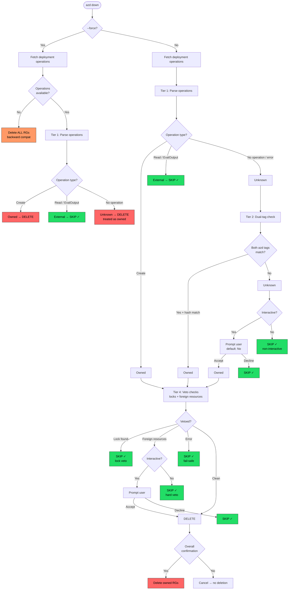

# Architecture Design: Multi-Tiered Resource Group Safety for `azd down`

## Overview

### Problem Statement

`azd down` deletes pre-existing resource groups that were merely referenced (via
Bicep `existing` keyword) but not created by the deployment. This causes
catastrophic, unrecoverable data loss.

**Root cause**: `resourceGroupsFromDeployment()` in `standard_deployments.go:370`
extracts ALL resource groups from ARM's `outputResources` and `dependencies`
fields without distinguishing created-vs-referenced resources.
`DeleteSubscriptionDeployment()` at line 429 then calls
`DeleteResourceGroup()` on every discovered RG indiscriminately.

**Real-world impact**: A user with a subscription-scoped Bicep template that
creates `rg-lego2` for Container Apps and references pre-existing `rg-lego-db`
(via `existing`) to assign a Cosmos DB role ran `azd down`. Both resource groups
were deleted — destroying a Cosmos DB account, PostgreSQL Flexible Server, role
assignments, and the resource group itself. All 25 delete operations share a
single correlation ID from one `azd down` invocation.

**Permission-dependent behavior**: With `Contributor` role, RG deletion may fail
(masking the bug). With `Owner` role, it succeeds silently.

### Scope

This design covers the `azd down` command's resource group deletion logic for
**Standard Deployments** (non-deployment-stacks), including **layered
provisioning** (multi-layer `azure.yaml` configurations).

**In scope**:
- `StandardDeployments.DeleteSubscriptionDeployment()` — subscription-scoped
- `StandardDeployments.DeleteResourceGroupDeployment()` — RG-scoped
- Layered provisioning (`infra.layers[]` in `azure.yaml`) — cross-layer
  resource group safety
- New `ResourceGroupOwnershipClassifier` pipeline

**Out of scope — Deployment Stacks**:
- `StackDeployments` (`stack_deployments.go`) is **not modified** by this design.
  Deployment stacks natively track managed vs unmanaged resources via ARM
  Deployment Stacks and already handle this correctly. Per Decision D5, when
  `FeatureDeploymentStacks` is enabled, the classification pipeline is
  bypassed entirely. This design exclusively targets the `StandardDeployments`
  code path, which is the default behavior for all azd users.

### Constraints

- **No deployment stacks dependency** — the fix must work with the default
  standard deployment path, not behind an alpha flag
- **Machine-independent** — must work when `azd up` runs on machine A and
  `azd down` runs on machine B
- **Graceful degradation** — must handle deleted deployment data, missing tags,
  API failures without defaulting to "delete everything"
- **Backward compatible** — resources provisioned before this change must not
  become undeletable; the system must degrade gracefully for pre-existing
  deployments
- **No new Azure permissions** — must work within the same permission set
  currently required by `azd down`

## Architecture

### Design Principle: Fail Safe

Every tier's failure mode is **"skip deletion"** — never "delete anyway." The
only path to deleting a resource group requires positive confirmation from at
least one ownership tier with no vetoes from the always-on safeguards. The
correct failure direction for a destructive operation is "we didn't delete
something we could have" not "we deleted something we shouldn't have."

### Component Design

#### 1. ResourceGroupOwnershipClassifier

**Location**: New type in `cli/azd/pkg/azapi/`

**Responsibility**: Determines whether azd created a given resource group by
querying multiple signals and producing a classification verdict.

```
// Actual implementation uses a function-based API:

// ClassifyResult holds the output of ClassifyResourceGroups.
type ClassifyResult struct {
    Owned   []string         // RG names approved for deletion
    Skipped []ClassifiedSkip // RG names skipped with reasons
}

type ClassifiedSkip struct {
    Name   string // resource group name
    Reason string // human-readable explanation (includes tier info)
}

// ClassifyResourceGroups evaluates each RG through the 4-tier pipeline.
func ClassifyResourceGroups(
    ctx context.Context,
    operations []*armresources.DeploymentOperation,
    rgNames []string,
    opts ClassifyOptions,
) (*ClassifyResult, error)
```

This classifier supports two classification modes:

1. **Snapshot-primary mode** (when `SnapshotPredictedRGs` is non-nil): Uses
   `bicep snapshot` → `predictedResources` as a deterministic, offline source.
   RGs in the predicted set are owned; RGs absent are external. Tier 4
   (locks/foreign resources) still runs as defense-in-depth.

2. **Tier pipeline mode** (fallback when snapshot unavailable): Runs the full
   Tier 1→2→3→4 pipeline as described below.

The snapshot approach is strictly better than Tier 1-3 because it reflects the
template's _current intent_ rather than historical deployment operations. Resources
declared with the Bicep `existing` keyword are excluded from `predictedResources`
by design, providing a direct signal of ownership.

#### 2. Enhanced DeleteSubscriptionDeployment

**Location**: Modified method in `standard_deployments.go`

**Responsibility**: Replace the current "delete all RGs" loop with a
classification-aware loop that only deletes RGs classified as `owned`.

**CRITICAL IMPLEMENTATION NOTE** *(from multi-model review MR-002)*:
The current `Deployment.Delete()` interface calls
`DeleteSubscriptionDeployment()`, which **independently re-discovers** all
RGs via `ListSubscriptionDeploymentResources()` → `resourceGroupsFromDeployment()`
and deletes them all. The classification result from `BicepProvider.Destroy()`
would never reach this deletion code. The implementer MUST choose one of:

- **(Recommended) Option A**: Move the per-RG deletion loop OUT of
  `DeleteSubscriptionDeployment()` into `BicepProvider.Destroy()`, which
  already has the classified list. `DeleteSubscriptionDeployment()` becomes
  a thin wrapper that only calls `voidSubscriptionDeploymentState()`.
  `BicepProvider` calls `DeleteResourceGroup()` directly for each owned RG.
- **Option B**: Add a `allowedResourceGroups []string` parameter to
  `DeleteSubscriptionDeployment()` (and update `DeploymentService` interface).
- **Option C**: Add a new `DeleteFilteredSubscriptionDeployment()` method.

Option A is cleanest because it keeps all classification logic and deletion
orchestration in `BicepProvider.Destroy()` — the same place that already
has the deployment, the resources, and the grouped RGs.

The current method:
1. Lists all resources from deployment
2. Extracts unique RG names
3. Deletes every RG

The new method (Option A):
1. `BicepProvider.Destroy()` calls `deployment.Resources()` (existing)
2. Groups by RG name (existing)
3. **Classifies each RG** via ResourceGroupOwnershipClassifier
4. Deletes only owned RGs by calling `resourceService.DeleteResourceGroup()`
   directly
5. Reports skipped RGs to the progress callback
6. Calls `voidSubscriptionDeploymentState()` ONLY after all intended
   deletions succeed (see MR-008 partial failure fix)

#### 3. Enhanced Destruction Preview

**Location**: Modified `promptDeletion()` in `bicep_provider.go`

**Responsibility**: Show users which resource groups will be deleted vs. skipped,
with clear provenance labels.

Current behavior: Shows a flat list of resources and asks "are you sure?"

New behavior: Groups resources by RG, labels each RG with its classification
(`azd-created` / `pre-existing` / `unknown`), and shows separate counts for
each category. For `unknown` RGs in interactive mode, prompts per-RG.

### Data Flow

```
azd down
  │
  ├─ BicepProvider.Destroy()
  │    │
  │    ├─ CompletedDeployments() ─── find most recent deployment
  │    │
  │    ├─ deployment.Resources() ─── get all resources (existing behavior)
  │    │
  │    ├─ GroupByResourceGroup() ─── group resources by RG name
  │    │
  │    ├─ *** NEW: getSnapshotPredictedRGs() ***
  │    │    ├─ Invoke `bicep snapshot` on current template
  │    │    ├─ Extract RGs from predictedResources (excludes `existing` keyword)
  │    │    └─ Return lowercased RG name set (nil on any error → triggers fallback)
  │    │
  │    ├─ *** NEW: ClassifyResourceGroups() ***
  │    │    │
  │    │    ├─ [Snapshot Path] ─── when SnapshotPredictedRGs is non-nil
  │    │    │    ├─ RG in predicted set? → classified "owned"
  │    │    │    ├─ RG NOT in predicted set? → classified "external" → SKIP
  │    │    │    └─ Tier 4 runs on owned candidates (defense-in-depth)
  │    │    │
  │    │    ├─ [Tier 1: Deployment Operations] ─── fallback, highest confidence
  │    │    │    ├─ Scan deployment.Operations()
  │    │    │    ├─ Create op on RG? → classified "owned"
  │    │    │    ├─ Read/EvaluateDeploymentOutput op? → classified "external" → SKIP
  │    │    │    └─ No ops at all? → classified "unknown" → fall to Tier 2
  │    │    │
  │    │    ├─ [Tier 2: Tag Verification] ─── only for "unknown" RGs
  │    │    │    ├─ Check RG for BOTH azd-env-name AND azd-provision-param-hash tags
  │    │    │    ├─ Both tags present and azd-env-name matches? → classified "owned"
  │    │    │    └─ Tags missing or mismatched? → fall to Tier 3
  │    │    │
  │    │    ├─ [Tier 3: Interactive Confirmation] ─── runs BEFORE Tier 4
  │    │    │    ├─ In interactive mode: prompt user per-RG with warning (default: No)
  │    │    │    │    "azd did not create resource group 'X'. Delete it? (y/N)"
  │    │    │    ├─ User accepts → merged into owned list for Tier 4 veto checks
  │    │    │    └─ Non-interactive (no --force): classify as "external" (NEVER deleted)
  │    │    │       --force: only Tier 1 runs (zero API calls), external RGs still protected
  │    │    │
  │    │    └─ [Tier 4: Always-On Safeguards] ─── runs on ALL deletion candidates
  │    │         ├─ Has CanNotDelete/ReadOnly lock? → SKIP (veto, best-effort)
  │    │         ├─ Contains resources NOT in deployment (without matching
  │    │         │    azd-env-name tag)? → soft veto (prompt if interactive)
  │    │         └─ API errors (500, 429, etc.) → treated as veto (fail-safe)
  │    │
  │    ├─ Enhanced promptDeletion() ─── show classified preview
  │    │    ├─ "WILL DELETE: rg-app (azd-created, Tier 1: deployment operations)"
  │    │    ├─ "SKIPPING: rg-shared-db (pre-existing, Tier 1: Read operation only)"
  │    │    ├─ Per-RG prompt for external/unknown RGs in interactive mode
  │    │    └─ Confirm deletion of owned resources
  │    │
  │    ├─ destroyDeployment() ─── delete only owned RGs
  │    │    ├─ Delete RGs classified as "owned" (or user-approved in interactive mode)
  │    │    ├─ Skip RGs classified as "external" or "unknown"
  │    │    ├─ Emit structured telemetry event per classification decision
  │    │    └─ Log all skip decisions for audit
  │    │
  │    ├─ Purge flow ─── ONLY for resources in non-skipped RGs
  │    │    ├─ Filter out Key Vaults/Cognitive/AppConfig in skipped RGs
  │    │    └─ Purge only resources in deleted RGs
  │    │
  │
  └─ Void deployment state (existing behavior)
```

### Classification Flow Diagram



## Patterns & Decisions

### Decision 1: Multi-Tier Classification over Single-Signal Ownership

**Pattern**: Defense in depth / Chain of responsibility

**Why**: Every individual ownership signal has a fatal flaw when used alone:

| Signal | Fatal Flaw |
|--------|-----------|
| ARM deployment operations | Gone if deployment data deleted from Azure |
| azd tags | User-writable; can be spoofed or manually added |
| Local state file | Not portable across machines |
| RG creation timestamp | Approximate; race conditions possible |
| Resource locks | Opt-in; most users don't set them |

By layering signals, the system tolerates any single signal being unavailable
or compromised. The key insight is that each tier's failure mode is "skip"
(safe) not "delete" (unsafe).

**Evaluation order**: Tier 1 (highest confidence, zero API calls) through Tier 3
(lowest confidence) run in sequence, stopping at the first tier that produces a
definitive answer. Tier 4 (always-on vetoes) then runs on ALL deletion candidates
to apply lock and foreign-resource checks regardless of which tier classified them.

### Decision 2: Deployment Operations as Primary Signal (Tier 1)

**Pattern**: Leverage existing infrastructure

**Why**: The `Deployment.Operations()` method already exists in `scope.go:66`
and calls `ListSubscriptionDeploymentOperations()`. ARM deployment operations
include a `provisioningOperation` field with values including `Create`, `Read`,
`EvaluateDeploymentOutput`, etc. Resources referenced via Bicep `existing`
keyword produce `Read` or `EvaluateDeploymentOutput` operations — never
`Create`. This is the single highest-confidence signal available.

**How it works**:
1. Call `deployment.Operations(ctx)` to get all deployment operations
2. Build a set of resource group names where an operation exists with:
   - `provisioningOperation == "Create"`
   - `targetResource.resourceType == "Microsoft.Resources/resourceGroups"`
3. Any RG in this set is classified as `owned`
4. Any RG with an explicit `Read` or `EvaluateDeploymentOutput` operation
   (but no `Create`) is classified as `external` — this is the high-confidence
   signal that the RG was referenced via Bicep `existing`
5. Any RG with NO operations at all is classified as `unknown` — NOT
   `external`. This handles: (a) nested Bicep module deployments where
   top-level operations don't flatten RG creates (see MR-004), (b)
   partially purged operation history. `unknown` falls through to Tier 2.

**IMPORTANT** *(from multi-model review MR-004)*: ARM does NOT flatten
nested deployment operations. If an RG is created inside a Bicep module
(not at the top level of `main.bicep`), the top-level operations will
show the module as `Microsoft.Resources/deployments` with no direct
`Create` for the RG. The implementer should either:
- Recursively walk nested deployment operations (check for
  `TargetResource.ResourceType == "Microsoft.Resources/deployments"`
  and query that sub-deployment's operations)
- Or classify as `unknown` (not `external`) and let Tier 2 handle it

Standard azd templates declare RGs at top level, so this primarily affects
user-customized templates. The `unknown` classification is the safe default.

**When it fails**: If deployment history has been purged from Azure (ARM retains
up to 800 deployments per scope). In this case, fall through to Tier 2.

### Decision 3: Dual-Tag Verification as Fallback (Tier 2)

**Pattern**: Multi-factor verification

**Why**: azd already applies `azd-env-name` tags during provisioning. By
checking for BOTH `azd-env-name` AND `azd-provision-param-hash` tags, we
reduce false positives — it is unlikely (though not impossible) that a user
manually adds both tags with correct values.

**Important**: Tags alone are never sufficient for deletion — this tier only
activates when Tier 1 is unavailable (deployment operations API returns error
or empty). Tags are a necessary-but-not-sufficient signal, strengthened by
requiring two matching tags rather than one.

### Decision 4: --force Runs Tier 1 Only (Zero-Cost Safety)

**Pattern**: Minimal-overhead safety even in CI/CD automation

**Why**: `--force` is used in CI/CD pipelines and scripts where operators want
teardown without prompts. However, deleting resource groups that azd didn't
create (external RGs referenced via Bicep `existing` keyword) contradicts the
core safety goal of this feature. Tier 1 classification (parsing deployment
operations) is free — zero extra API calls — and can identify external RGs
with high confidence.

**Behavior**: When `--force` is set, only Tier 1 runs. External RGs identified
by Read or EvaluateDeploymentOutput operations are still protected (skipped).
Unknown RGs (no matching operation) are treated as owned and deleted. Tiers
2/3/4 are skipped entirely (no tag lookups, no prompts, no lock checks).

**Degradation**: If deployment operations are unavailable (ARM transient error),
`--force` falls back to deleting all RGs for backward compatibility. This is
logged as a WARNING.

No `--delete-resource-groups` or similar bulk override flag exists. This is
a deliberate design choice: azd will never delete a resource group it didn't
create without per-RG human consent.

### Decision 5: Always-On Safeguards as Veto Layer (Tier 4)

**Pattern**: Circuit breaker / Invariant checks

**Why**: Certain conditions should ALWAYS prevent deletion regardless of what
ownership signals say. These are hard vetoes that override all other tiers:

1. **Resource locks** *(best-effort)*: If an RG has a `CanNotDelete` or `ReadOnly`
   lock, it was explicitly protected by someone. Attempting to delete it will
   fail anyway — better to skip it proactively. **Important**: The lock check
   requires `Microsoft.Authorization/locks/read` permission which azd does not
   currently require. Per the "no new permissions" constraint, this check is
   **best-effort**: if the API returns 403, skip the lock check sub-tier
   entirely (do NOT veto) and log a warning. Alternatively, the implementer
   may omit this check and let ARM's own lock enforcement produce a clear
   error at `DeleteResourceGroup` time.

2. **Extra resources**: If an RG contains resources that are NOT in the
   deployment's resource list AND do not have an `azd-env-name` tag matching
   the current environment, it likely contains resources from other
   deployments or manual provisioning. Deleting the RG would destroy those
   resources as collateral damage. Resources from sibling layers (which share
   the same `azd-env-name` tag) are NOT counted as extra — this enables
   correct behavior in layered provisioning scenarios (see "Layered
   Provisioning Support" section).

3. **~~Timestamp heuristic~~** *(REMOVED — see Multi-Model Review MR-001)*:
   The original design proposed vetoing when `RG.createdTime < deployment.Timestamp`.
   Multi-model review (Opus, Codex, Goldeneye — all 3 independently) identified
   this as critically flawed: on any re-deployment, the RG was created during the
   *first* `azd up` while the deployment timestamp reflects the *latest* `azd up`,
   so the comparison is always true for re-provisioned environments. Additionally,
   ARM SDK does not expose `createdTime` without raw REST `$expand=createdTime`.
   **This sub-tier is removed entirely.** Tiers 1 and 2 plus lock/extra-resource
   checks provide sufficient safety without this fragile heuristic.

## Layered Provisioning Support

### Background

azd supports **layered provisioning** where `azure.yaml` defines multiple
infrastructure layers under `infra.layers[]`. Each layer is a separate Bicep
(or Terraform) module with its own ARM deployment. During `azd down`, layers
are processed in **reverse order** — the last layer provisioned is the first
layer destroyed (`slices.Reverse(layers)` in `down.go:134`).

Each layer gets:
- Its own deployment name: `{envName}-{layerName}`
- Its own ARM deployment with tags: `azd-env-name`, `azd-layer-name`,
  `azd-provision-param-hash`
- Its own independent `provisionManager.Initialize()` + `Destroy()` cycle

### Cross-Layer Resource Group Scenarios

The classification pipeline runs per-layer (each layer processes independently).
The reverse ordering creates important interactions:

**Scenario 1: Layer 1 creates RG, Layer 2 references it via `existing`**

Processing order: Layer 2 first, then Layer 1.

1. Layer 2: Tier 1 checks deployment operations → RG has `Read` operation
   (not `Create`) → classified as `external` → **SKIP**
2. Layer 1: Tier 1 checks deployment operations → RG has `Create` operation
   → classified as `owned` → **DELETE**

Result: Correct. The creating layer deletes the RG after the referencing
layer has been processed.

**Scenario 2: Both layers reference a pre-existing RG**

1. Layer 2: classified as `external` → SKIP
2. Layer 1: classified as `external` → SKIP

Result: Correct. Pre-existing RG is preserved.

**Scenario 3: Layer 1 creates RG, Layer 2 deploys resources into it**

This is the complex case. Layer 2 processes first and skips the RG (correct).
When Layer 1 processes, the RG contains resources from both layers. Layer 2's
resources are still present because the RG was not deleted.

Without cross-layer awareness, Tier 4's extra-resource check would find
Layer 2's resources and veto deletion — even though Layer 1 legitimately
created the RG.

**Solution: azd-env-name-aware extra-resource check**

The Tier 4 extra-resource check is refined to distinguish truly foreign
resources from sibling-layer resources:

- Query the RG's actual resources via `ListResourceGroupResources()`
- For each resource NOT in the current layer's deployment resource list:
  - Check if the resource has an `azd-env-name` tag matching the current
    environment name
  - If YES: the resource belongs to a sibling layer or this deployment —
    it is NOT counted as "extra"
  - If NO: the resource is truly foreign (manually created, from another
    deployment, etc.) — it IS counted as "extra" and triggers the veto

This approach:
- Requires no pre-scan pass across layers
- Works because azd tags resources with `azd-env-name` during provisioning
- Correctly identifies resources from sibling layers as "safe"
- Still catches truly foreign resources (those without azd tags or with a
  different environment name)

**Scenario 3 with the fix**:

1. Layer 2: Tier 1 → `external` → SKIP
2. Layer 1: Tier 1 → `owned`. Tier 4 extra-resource check finds Layer 2's
   resources, but they have `azd-env-name` matching the current env →
   NOT counted as extra → no veto → **DELETE**

Result: Correct. The RG is deleted by the layer that created it, and
sibling-layer resources are recognized as part of the same deployment
environment.

### Layer-Specific Deployment Name Resolution

Each layer's deployment has a unique name (`{envName}-{layerName}`). The
classifier uses the deployment associated with the current layer being
processed. This means:

- Tier 1 queries operations from the CURRENT layer's deployment only
- Tier 2 checks tags on the RG (layer-agnostic — `azd-env-name` is shared
  across layers)
- Tier 4's extra-resource check uses the azd-env-name-aware logic above

No changes are needed to the layer iteration loop in `down.go`. The
classification pipeline is fully layer-compatible by design.

## Gap Remediation

### 🚫 Anti-Pattern: Unfiltered Resource Group Deletion (Critical)

**Current code** (`standard_deployments.go:429-476`):
```go
for resourceGroup := range resourceGroups {
    if err := ds.resourceService.DeleteResourceGroup(ctx, subscriptionId, resourceGroup); err != nil {
        // ...
    }
}
```

**Fix**: Replace with classification-aware deletion:
```go
for _, classified := range classifiedGroups {
    if classified.Classification != ClassificationOwned {
        progress.SetProgress(DeleteDeploymentProgress{
            Name:    classified.Name,
            Message: fmt.Sprintf("Skipping resource group %s (%s)",
                output.WithHighLightFormat(classified.Name), classified.Reason),
            State:   DeleteResourceStateSkipped,
        })
        continue
    }
    // ... existing delete logic for owned RGs
}
```

This requires adding a `DeleteResourceStateSkipped` state to the existing
`DeleteResourceState` enum.

### 🚫 Anti-Pattern: Operations() Never Used in Destroy Path (Critical)

**Current state**: `Deployment.Operations()` exists in `scope.go:66` and is
fully functional, but `BicepProvider.Destroy()` only calls
`deployment.Resources()` — never `deployment.Operations()`.

**Fix**: In the new classification pipeline, call `deployment.Operations()`
to retrieve deployment operations and filter by `provisioningOperation`.

### ⚠️ Gap: No Resource Lock Check (High)

**Current state**: `DeleteResourceGroup()` in `resource_service.go:297` calls
ARM's `BeginDelete` directly. If the RG has a lock, this fails with an error
mid-operation — potentially after other RGs have already been deleted.

**Fix**: Before entering the deletion loop, query locks for each candidate RG
via the ARM management locks API. Skip locked RGs proactively.

### ⚠️ Gap: --force Bypasses All Safety (High) — RESOLVED

**Current state**: `--force` now runs Tier 1 classification (zero extra API
calls) before deleting. External RGs identified by deployment operations
(Read/EvaluateDeploymentOutput) are still protected even with `--force`.

```go
// --force: Tier 1 only. External RGs protected, unknowns treated as owned.
// If operations unavailable: backward compat (all deleted).
classifyOpts.ForceMode = true
```

**Resolution**: Tier 1 is free (parses already-fetched deployment operations).
Running it with `--force` provides zero-cost protection for external RGs while
preserving CI/CD semantics (no prompts, no extra API calls). Tiers 2/3/4 are
skipped entirely in force mode. See Decision 4.

### ⚠️ Gap: No Extra-Resource Detection (Medium)

**Current state**: `ListSubscriptionDeploymentResources()` calls
`ListResourceGroupResources()` to get all resources in each RG, but only uses
the result to build the deletion list. It never compares the RG's actual
contents against the deployment's expected contents.

**Fix**: Compare the resource IDs returned by `ListResourceGroupResources()`
against the resource IDs in the deployment's `Resources()`. If the RG contains
resources not in the deployment, flag it as a veto in Tier 4.

### 🔄 Modernization: DeleteResourceGroupDeployment Parity (Medium)

**Current state**: `DeleteResourceGroupDeployment()` at line 521 also deletes
the RG unconditionally. For RG-scoped deployments, this is less dangerous
(the RG is the deployment scope itself), but the same safety checks should
apply.

**Fix**: Apply the same classification pipeline to RG-scoped deletions.
Since there is only one RG in this case, the classification is simpler but
should still check for locks and extra resources.

## Risks & Trade-offs

### Risk 1: Deployment Operations Unavailable for Old Deployments

**Severity**: Medium

**Description**: ARM has a retention limit of 800 deployments per scope. For
very old deployments, operations data may have been purged. The Tier 1 signal
would be unavailable.

**Mitigation**: Fall through to Tier 2 (tag check). For deployments created
before this change, both Tier 1 and Tier 2 may be degraded. In that case,
Tier 3 (interactive confirmation) activates. In `--force` mode, only Tier 1
runs; if operations are also unavailable, all RGs are deleted (backward
compatibility). Without `--force`, RGs with unknown provenance are
skipped in non-interactive mode, or prompted in interactive mode.

### Risk 2: Performance Impact of Additional API Calls

**Severity**: Low

**Description**: The classification pipeline adds API calls: deployment
operations list, resource group metadata (tags, locks, timestamps). For a
deployment with N resource groups, this adds O(N) API calls.

**Mitigation**: N is typically small (1-5 RGs). The deployment operations
call is a single paginated request regardless of N. RG metadata queries can
be parallelized. The total added latency should be <5 seconds for typical
deployments. This is acceptable for a destructive operation where safety
trumps speed.

### Risk 3: False Negatives (Refusing to Delete an azd-Created RG)

**Severity**: Medium

**Description**: The multi-tier system may incorrectly classify an
azd-created RG as `unknown` or `external` if: (a) deployment operations
are purged, (b) tags were removed by another process, (c) the RG was
recreated outside azd after initial provisioning.

**Mitigation**: In interactive mode (without `--force`), `unknown` RGs
trigger a per-RG prompt - the user can explicitly approve deletion with a
conscious decision (default is No). In `--force` mode, only Tier 1 runs —
unknown RGs (no operation data) are treated as owned and deleted, so false
negatives from Tier 2/3 don't apply.

### Risk 4: Backward Compatibility with Existing Deployments

**Severity**: Medium

**Description**: Users who have been running `azd down` successfully (because
they only have azd-created RGs) should see no change in behavior. Users whose
deployments reference pre-existing RGs will see new behavior (those RGs are
now skipped).

**Mitigation**: The new behavior is strictly safer — it only reduces the set
of RGs that get deleted, never expands it. Existing workflows where all RGs
are azd-created will classify as `owned` via Tier 1 and proceed normally.
The only change users will notice is that pre-existing RGs are now preserved
(which is the correct behavior).

### Risk 5: Tag Spoofing in Tier 2

**Severity**: Low

**Description**: A malicious actor could add `azd-env-name` and
`azd-provision-param-hash` tags to a victim resource group, causing azd
to classify it as "owned" and delete it.

**Mitigation**: Tier 2 only activates when Tier 1 is unavailable. When both
tiers are active, Tier 1 takes precedence. Additionally, Tier 4's
extra-resource check would likely catch this scenario — the victim RG would
contain resources not in the deployment. Tag spoofing requires write access
to the victim RG, which implies the attacker already has significant
privileges.

## Resolved Design Decisions

### D1: No Bulk Override Flag — Per-RG Consent Only

**Decision**: There is NO flag combination that bulk-deletes external resource
groups. azd will NEVER delete a resource group it didn't create unless the user
explicitly approves each one individually in an interactive session.

**Flag behavior**:
- `--force` — Runs Tier 1 only (zero extra API calls). External RGs identified
  by deployment operations are still protected. Unknown RGs are treated as owned.
  Tiers 2/3/4 are skipped (no prompts, no extra API calls). If deployment
  operations are unavailable, falls back to deleting all RGs (backward compat).
  See Decision 4.
- `--purge` — Unchanged (soft-delete purging only).
- No new flags are added.

**Behavior by mode**:
- **Interactive (no --force)**: Classification runs. Owned RGs are confirmed
  with an overall prompt. Unknown RGs get per-RG prompts with default No.
  External RGs are never deleted.
- **Non-interactive (CI/CD, no --force)**: Classification runs. Only owned
  RGs are deleted. External/unknown RGs are skipped with logged reason.
- **--force**: Tier 1 only. External RGs protected; unknown RGs deleted.
  No prompts, no extra API calls. Operations unavailable → all deleted.

### D2: Structured Telemetry for Classification Decisions

**Decision**: Emit structured telemetry events for every classification
decision. Each event includes: resource group name, classification result
(owned/external/unknown), tier that produced the verdict, reason string,
and deployment name. This enables debugging user support tickets and
measuring the safety system's effectiveness.

### D3: Full Pipeline for RG-Scoped Deployments

**Decision**: `DeleteResourceGroupDeployment()` runs the same full 4-tier
classification pipeline as subscription-scoped deployments. Even though the
RG is the deployment scope itself (and was typically created before
`azd provision`), the classification will correctly identify it as external
via Tier 1 (no `Create` operation for the RG in deployment operations) and
prompt the user accordingly.

### D4: Skip Purge for Resources in Skipped RGs

**Decision**: When a resource group is classified as external and skipped
during deletion, the purge flow (Key Vaults, Cognitive Services, App
Configurations, API Management, Log Analytics Workspaces) also skips
resources within that RG. The purge flow receives the set of skipped RG
names and filters them out.

### D5: Skip Classification When Deployment Stacks Active

**Decision**: When the `FeatureDeploymentStacks` alpha flag is enabled and
the deployment uses the `StackDeployments` code path, the classification
pipeline is bypassed. Deployment stacks natively track managed vs unmanaged
resources and handle this correctly. The classification pipeline only runs
for `StandardDeployments`.

### D6: Extra-Resource Veto (azd-env-name-aware, soft in interactive mode)

**Decision**: The Tier 4 extra-resource check uses an absolute threshold:
if a resource group contains ANY resource that is (a) not present in the
current layer's deployment resource list AND (b) does not have an
`azd-env-name` tag matching the current environment, the Tier 4 veto
triggers. Resources from sibling layers (which share the same
`azd-env-name` tag) are excluded from the "extra" count — this prevents
false vetoes in layered provisioning scenarios. See the "Layered
Provisioning Support" section for detailed scenario analysis.

**Interactive mode refinement** *(from multi-model review MR-010)*: In
interactive mode (no `--force`), the extra-resource veto is a **soft veto**:
the user is shown the foreign resources and asked for explicit per-RG
confirmation (default No). This handles the common case where users manually
add experimental resources to azd-managed RGs. In non-interactive mode
(no `--force`), the veto remains **hard** - foreign resources unconditionally
block deletion. Note: `--force` bypasses classification entirely per
Decision 4, so the veto check doesn't apply.

## Affected Files

### Primary Changes

| File | Change |
|------|--------|
| `cli/azd/pkg/azapi/standard_deployments.go` | Extract RG deletion loop. `DeleteSubscriptionDeployment()` becomes thin wrapper for `voidSubscriptionDeploymentState()`. Classification-aware deletion moves to `BicepProvider`. |
| `cli/azd/pkg/azapi/resource_service.go` | Add `GetResourceGroupWithTags()` method. Verify `ListResourceGroupResources()` returns tags on resources. |
| `cli/azd/pkg/azapi/deployments.go` | Add `DeleteResourceStateSkipped` to the state enum. |

### New Files

| File | Purpose |
|------|---------|
| `cli/azd/pkg/azapi/resource_group_classifier.go` | `ResourceGroupOwnershipClassifier` type with 4-tier classification pipeline. |
| `cli/azd/pkg/azapi/resource_group_classifier_test.go` | Unit tests for each tier and their combinations. |

### Secondary Changes

| File | Change |
|------|--------|
| `cli/azd/pkg/infra/provisioning/bicep/bicep_provider.go` | Major restructure of `Destroy()`: add classifier call, move deletion loop from `DeleteSubscriptionDeployment` here, filter purge targets by classification, void state only on full success. Modify `promptDeletion()` to show classified preview with summary table UX. |
| `cli/azd/cmd/down.go` | Modify `--force` behavior documentation. No new flags. |
| `cli/azd/pkg/infra/scope.go` | No structural changes — `Operations()` already exists and is sufficient. |

### Test Files

| File | Purpose |
|------|---------|
| `cli/azd/pkg/azapi/standard_deployments_test.go` | Add tests for classification-aware deletion. |
| `cli/azd/pkg/azapi/resource_group_classifier_test.go` | Unit tests for each tier and their combinations, including cross-layer scenarios. |
| `cli/azd/pkg/infra/provisioning/bicep/bicep_provider_test.go` | Add tests for enhanced prompt and destroy flow, including layered provisioning. |

## Multi-Model Review Findings

This design was reviewed by three independent AI models (Claude Opus 4.6,
GPT-5.3-Codex, Goldeneye) acting as hostile critics. Below are the merged,
deduplicated findings with their resolutions. Each finding ID uses `MR-NNN`
(Merged Review) with the originating model(s) noted.

### MR-001 [CRITICAL] — Timestamp Veto Breaks All Re-Deployment Scenarios
**Models**: [Opus] [Codex] [Goldeneye] — unanimous consensus

**Problem**: The Tier 4 rule `RG.createdTime < deployment.Timestamp → SKIP`
is always true for re-provisioned environments. On first `azd up` (Monday),
RG is created. On second `azd up` (Friday), deployment timestamp updates.
`azd down` (Saturday): Monday < Friday → VETO. Every re-deployed azd
environment becomes undeletable.

Additionally, ARM SDK's `ResourceGroupProperties` does not expose
`createdTime`; it requires raw REST `$expand=createdTime` (not in typed SDK).

**Resolution**: **Removed entirely**. The timestamp sub-tier has been deleted
from Tier 4. The remaining checks (locks + extra-resource) combined with
Tiers 1-3 provide sufficient safety. Timestamps are too fragile and
require SDK workarounds.

### MR-002 [CRITICAL] — Classification Result Never Reaches Deletion Code
**Models**: [Opus]

**Problem**: `BicepProvider.Destroy()` calls `deployment.Delete()` →
`DeleteSubscriptionDeployment()`, which independently re-discovers ALL RGs
and deletes them. The classification result is architecturally disconnected
from the code that performs deletion. Without restructuring, classification
is dead code.

**Resolution**: **Design updated** (see "Enhanced DeleteSubscriptionDeployment"
section). Recommended approach: move the per-RG deletion loop from
`DeleteSubscriptionDeployment()` into `BicepProvider.Destroy()`, which
already has the classified list. `BicepProvider` calls
`resourceService.DeleteResourceGroup()` directly for owned RGs. The
`DeleteSubscriptionDeployment()` method becomes a thin wrapper for
`voidSubscriptionDeploymentState()` only.

### MR-003 [HIGH] — Purge Targets Computed Before Classification
**Models**: [Goldeneye]

**Problem**: `BicepProvider.Destroy()` computes Key Vault / Managed HSM /
App Config / APIM / Cognitive / Log Analytics purge targets BEFORE the
classification step. If an RG is later classified as external and skipped,
its resources are still in the purge lists. D4 says "skip purge for skipped
RGs" but the current data flow doesn't enforce this.

**Resolution**: Purge target collection must happen AFTER classification, or
the purge lists must be filtered against the `skippedRGs` set before
execution. The implementer should:
1. Run classification first
2. Filter `groupedResources` to owned-only RGs
3. Then compute purge targets from the filtered set
This is a natural consequence of MR-002's restructuring.

### MR-004 [HIGH] — Deployment Operations Not Flattened for Nested Modules
**Models**: [Opus]

**Problem**: ARM does NOT flatten nested deployment operations. If an RG is
created inside a Bicep module, the top-level operations show the module as
a `Microsoft.Resources/deployments` operation — no `Create` for
`Microsoft.Resources/resourceGroups` appears at the top level.

Standard azd templates declare RGs at top level (not affected), but
user-customized templates may use module-based patterns.

**Resolution**: **Design updated** (see Decision 2). Tier 1 now classifies
as `unknown` (not `external`) when no operations of any kind are found for
an RG, allowing fallback to Tier 2. The implementer may optionally add
recursive operation walking for nested deployments.

### MR-005 [HIGH] — Lock Check Requires New Azure Permissions
**Models**: [Opus]

**Problem**: The lock check calls `Microsoft.Authorization/locks` API which
requires `Microsoft.Authorization/locks/read` permission. azd does not
currently require this. Violates the "no new permissions" constraint.

**Resolution**: **Design updated** — lock check is now **best-effort**. If
the API returns 403 Forbidden, skip the lock sub-tier (do NOT veto) and log
a warning. Alternatively, the implementer may omit the lock check entirely
— ARM's own lock enforcement produces a clear error at deletion time.

### MR-006 [HIGH] — `--force` + Degraded Tiers = Permanently Undeletable in CI
**Models**: [Opus]

**Problem**: When Tier 1 is unavailable (deployment history purged) AND
Tier 2 fails (tags missing), Tier 3 in `--force` mode classifies as
`external` → never deleted. D1 prohibits any override flag. CI/CD
pipelines that use `azd down --force` for teardown silently fail to delete
owned RGs, accumulating orphans.

**Resolution**: Accept this as a deliberate safety trade-off — it's better
to orphan RGs in CI than to risk deleting production databases. Add a clear
log message: "Resource group 'X' could not be verified as azd-created.
Run `azd provision` to re-establish ownership signals, then retry
`azd down`." The `azd provision` path will create fresh deployment
operations (Tier 1) and tags (Tier 2), enabling successful deletion.

### MR-007 [HIGH] — RG-Scoped Deployments Lack Equivalent Evidence
**Models**: [Goldeneye]

**Problem**: D3 applies the full pipeline to RG-scoped deployments, but the
evidence model is different. In RG-scoped deployments, the RG IS the
deployment scope — there is no "RG Create operation" in deployment operations
because the RG is the container, not a deployed resource. The current
`DeleteResourceGroupDeployment()` directly deletes without enumeration.

**Resolution**: For RG-scoped deployments, modify the pipeline:
- Tier 1: Check if the deployment operations contain ANY `Create` operations
  for resources inside the RG. If yes, azd deployed into this RG → `owned`.
  If the RG was created OUTSIDE azd (e.g., user created it manually and set
  `AZURE_RESOURCE_GROUP`), there will be no deployment history → `unknown`.
- Tier 2: Same tag check applies (RG tags).
- Tier 4 extra-resource check: Compare deployment resources against actual
  RG contents (same logic).
- Tier 3: Interactive prompt as normal.

### MR-008 [HIGH] — Void Deployment State Destroys Evidence on Partial Failure
**Models**: [Opus] [Goldeneye]

**Problem**: After deleting RGs, `voidSubscriptionDeploymentState()` deploys
an empty template that becomes the most recent deployment. On partial failure
(e.g., 2 of 3 RGs deleted), the void deployment is created. Retry finds the
void deployment (no resources, no operations) → "No resources found." The
surviving RG is orphaned.

**Resolution**: **Defer voiding until ALL intended deletions succeed.** If
any deletion fails, do NOT void the deployment state. This preserves
Tier 1 evidence for retry. The implementer should:
1. Delete all owned RGs first (collecting errors)
2. Only call `voidSubscriptionDeploymentState()` if all deletions succeeded
3. On partial failure, return the error without voiding — user can retry
   `azd down` and the classification will work correctly

### MR-009 [HIGH] — `--force` Can Bypass if Classification Attached to Prompting
**Models**: [Goldeneye]

**Problem**: Existing `promptDeletion()` returns `nil` immediately when
`options.Force()` is true. If any safety logic is placed in or after the
prompt path, `--force` bypasses it entirely.

**Resolution**: Classification is separated from prompting in a dedicated
`classifyAndDeleteResourceGroups()` function. The `--force` flag bypasses
classification entirely (per Decision 4), deleting all RGs to preserve
CI/CD semantics. When `--force` is not set, classification runs in full.
This eliminates the original risk of prompt-path bypass.

### MR-010 [MEDIUM] — Tier 4 Absolute Veto Blocks Interactive User Override
**Models**: [Opus]

**Problem**: Users who manually add experimental resources to azd-managed
RGs find `azd down` refuses to clean up. The veto is absolute with no
override path, even in interactive mode.

**Resolution**: **Design updated** (see D6). In interactive mode, the
extra-resource veto is a soft veto — user is shown the foreign resources
and prompted per-RG. In `--force`/CI mode, it remains a hard veto.

### MR-011 [MEDIUM] — Failed Deployment Cleanup Path Differs from Succeeded
**Models**: [Goldeneye]

**Problem**: `resourceGroupsFromDeployment()` has two branches: succeeded
(uses `outputResources`) and failed (uses `dependencies`). These carry
different fidelity. The failed path is exactly when `azd down` is most
needed.

**Resolution**: The classifier must handle both paths. For failed
deployments:
- `deployment.Operations()` may be partially populated — use what's
  available
- `deployment.Dependencies` may include RGs that were never actually
  created — Tier 1 would show no `Create` op → correctly classified as
  `unknown`/`external`
- Add explicit tests for: fail-before-RG-create, fail-after-RG-create,
  canceled deployment, and partial Operations() availability

### MR-012 [MEDIUM] — Terraform Provider Not Covered
**Models**: [Goldeneye]

**Problem**: The design is ARM/Bicep-centric. azd supports Terraform where
ownership signals come from Terraform state, not ARM deployment operations.

**Resolution**: This design targets the Bicep provider (`bicep_provider.go`)
which is the primary path. Terraform's destroy path uses `terraform destroy`
which has its own state management. Add to Scope section: "Terraform
provider is out of scope for this design — Terraform's state-based
destruction already tracks which resources it manages." Future work may
add a provider-neutral classification contract.

### MR-013 [MEDIUM] — TOCTOU Window Between Classification and Deletion
**Models**: [Codex]

**Problem**: Locks/tags/resources can change between classification and
deletion. External actors or parallel azd runs could modify state.

**Resolution**: Accept as inherent to any non-transactional system.
Mitigation: classify ALL RGs before deleting ANY (batch classification,
then batch deletion). This minimizes the window. ARM's own lock
enforcement provides a final safety net at deletion time.

### MR-014 [MEDIUM] — ARM Throttling and Permission Edge Cases
**Models**: [Codex] [Goldeneye]

**Problem**: New API calls (operations, locks, resource enumeration) risk
ARM 429 throttling and custom RBAC roles may allow deletion but not reads.

**Resolution**: Implement retry with exponential backoff + jitter for all
ARM calls. Distinguish 403 (skip check, log warning) from 429 (retry)
from 5xx (retry with backoff). Use goroutines with a semaphore for parallel
per-RG Tier 4 checks. See Implementation Guide.

### MR-015 [LOW] — ARM SDK Pointer Types Require Nil Guards
**Models**: [Opus]

**Problem**: `DeploymentOperationProperties.ProvisioningOperation`,
`TargetResource`, and `TargetResource.ResourceType` are all pointer types.
Existing tests set `ProvisioningState` but not these fields, confirming
they can be nil.

**Resolution**: Mandate nil checks for all pointer fields before comparison.
Skip operations where any required field is nil. See Implementation Guide.

### MR-016 [LOW] — Per-RG Prompting UX at Scale
**Models**: [Goldeneye]

**Problem**: Per-RG prompts don't scale for 10+ RGs across layers.

**Resolution**: Show a summary table of all classification decisions first:
```
Resource Groups to delete:
  ✓ rg-app (azd-created, Tier 1)
  ✓ rg-web (azd-created, Tier 1)
  ✗ rg-shared-db (pre-existing, skipped)
  ? rg-experiment (unknown — contains 2 extra resources)
```
Then prompt ONCE for the unknown set: "Delete 1 unverified resource group?
(y/N)" For owned RGs, show total count and confirm once (unless `--force`).

### MR-017 [LOW] — Go Concurrency Footgun in Parallel Checks
**Models**: [Codex]

**Problem**: Parallel per-RG metadata queries writing to shared maps/slices
can cause `concurrent map writes` panics.

**Resolution**: Use immutable per-worker results + channel fan-in pattern.
Each goroutine returns its `ClassifiedResourceGroup` via a channel. The
collector assembles the final slice. Run with `-race` in CI. See
Implementation Guide.

## Implementation Guide for Developers

### Tip 1: Restructure the Deletion Flow (MR-002 — CRITICAL, do this first)

The single most important structural change: move the deletion loop from
`DeleteSubscriptionDeployment()` into `BicepProvider.Destroy()`.

```
Current flow:
  BicepProvider.Destroy() → deployment.Delete() → DeleteSubscriptionDeployment()
    → re-discovers RGs → deletes ALL

New flow:
  BicepProvider.Destroy()
    → deployment.Resources() (already called)
    → GroupByResourceGroup() (already called)
    → ClassifyResourceGroups() (NEW)
    → for each owned RG: resourceService.DeleteResourceGroup()
    → voidSubscriptionDeploymentState() (only if all succeeded)
```

`deployment.Delete()` should be refactored or a new path created. The
classifier needs access to `deployment.Operations()` and
`resourceService.ListResourceGroupResources()` — pass these as
dependencies to the classifier constructor.

### Tip 2: ARM SDK Nil Guard Pattern

Every field access on `DeploymentOperation` must be guarded:

```go
for _, op := range operations {
    if op.Properties == nil ||
        op.Properties.ProvisioningOperation == nil ||
        op.Properties.TargetResource == nil ||
        op.Properties.TargetResource.ResourceType == nil ||
        op.Properties.TargetResource.ResourceName == nil {
        continue // skip incomplete operations
    }
    if *op.Properties.ProvisioningOperation == armresources.ProvisioningOperation("Create") &&
        *op.Properties.TargetResource.ResourceType == "Microsoft.Resources/resourceGroups" {
        ownedRGs[*op.Properties.TargetResource.ResourceName] = true
    }
}
```

### Tip 3: Tier Evaluation Order and Short-Circuiting

Consider reordering the tiers for performance. The design says Tier 4
(vetoes) runs first, but Tier 1 (deployment operations) is a SINGLE
API call that covers ALL RGs at once. Suggested implementation order:

```
1. Call deployment.Operations() once (Tier 1 data, 1 API call for all RGs)
2. For each RG:
   a. Run Tier 1 classification from cached operations
   b. If classified "owned" → run Tier 4 veto checks (extra-resource, locks)
   c. If classified "external" → skip (no Tier 4 needed)
   d. If Tier 1 unavailable → run Tier 2 (tags), then Tier 4 if "owned"
   e. If still unknown → Tier 3 (prompt or skip)
```

This way, Tier 4's per-RG API calls (resource enumeration, locks) only
run for RGs that are candidates for deletion — typically 1-3 RGs, not all
referenced RGs.

### Tip 4: Parallelize Tier 4 Per-RG Checks

```go
type classifyResult struct {
    name           string
    classification ResourceGroupClassification
    tier           int
    reason         string
    err            error
}

results := make(chan classifyResult, len(rgNames))
sem := make(chan struct{}, 5) // limit to 5 concurrent ARM calls

for _, rg := range rgNames {
    go func(rgName string) {
        sem <- struct{}{}
        defer func() { <-sem }()
        // run Tier 4 checks for this RG
        results <- classifyResult{...}
    }(rg)
}

classified := make([]ClassifiedResourceGroup, 0, len(rgNames))
for range rgNames {
    r := <-results
    classified = append(classified, ...)
}
```

### Tip 5: Handle Both Deployment States (Succeeded vs Failed)

`resourceGroupsFromDeployment()` has two branches. Your classifier
receives the RG names from this function regardless of which branch
produced them. For FAILED deployments:
- `deployment.Operations()` may be partially populated — use it
- Some RGs in the candidate set may never have been created — Tier 1
  will show no Create op (correct: `unknown`/`external`)
- `DeleteResourceGroup()` for a non-existent RG returns 404 — handle
  this as success (already gone), not as a fatal error

### Tip 6: Testing Strategy

Use the existing `mocks.NewMockContext` and `mockexec.MockCommandRunner`
patterns. The classifier is highly testable because each tier is a
discrete function:

```
Test matrix:
- Tier 1: Create op found / Read op found / No ops / API error / nil fields
- Tier 2: Both tags / one tag / no tags / wrong env name / API error
- Tier 4: No extra resources / extra with azd tag / extra without tag /
          lock present / lock check 403
- Tier 3: Interactive approve / deny / --force mode
- Cross-tier: Tier 4 veto overrides Tier 1 owned / Tier 1 unavailable falls
              to Tier 2 / All tiers degrade gracefully
- Layered: Scenario 1/2/3 from architecture doc
- Failed deployments: fail-before-RG-create / fail-after / canceled
- Partial deletion: RG1 succeeds, RG2 fails, void NOT called
```

### Tip 7: `--force` Bypasses Classification (Decision 4)

Per Decision 4, `--force` bypasses the entire classification pipeline and
deletes all discovered RGs. This preserves original CI/CD semantics.
Classification only runs when `--force` is not set.

```go
// --force: bypass classification, delete all RGs
if options.Force() {
    deleted, err = deleteRGList(ctx, subId, rgNames, ...)
    return deleted, nil, err
}

// No --force: run full classification pipeline
classified := ClassifyResourceGroups(ctx, ops, rgNames, opts)
// prompt for owned RGs, skip external/unknown
```

### Tip 8: Void State Only After Full Success

```go
// Delete all owned RGs, collecting results
var deleteErrors []error
for _, rg := range ownedRGs {
    if err := resourceService.DeleteResourceGroup(ctx, subId, rg.Name); err != nil {
        deleteErrors = append(deleteErrors, fmt.Errorf("deleting %s: %w", rg.Name, err))
    }
}

// Only void if ALL succeeded
if len(deleteErrors) == 0 {
    if err := voidSubscriptionDeploymentState(ctx, subId, deploymentName, opts); err != nil {
        return fmt.Errorf("voiding deployment state: %w", err)
    }
} else {
    return errors.Join(deleteErrors...)
}
```

### Tip 9: Tag Access Requires Code Change in ResourceService

The existing `ResourceService.ListResourceGroup()` (resource_service.go)
strips tags from the response. The classifier needs RG tags for Tier 2 and
Tier 4 (azd-env-name on extra resources). Either:
- Add a `GetResourceGroupWithTags()` method that preserves the ARM response's
  `Tags` field
- Or modify `Resource` struct to include `Tags map[string]*string`

Similarly, `ListResourceGroupResources()` returns `ResourceExtended` which
includes tags — verify this is sufficient for the Tier 4 extra-resource
check on individual resources.

### Tip 10: Error Handling for ARM API Degradation

Each Tier's ARM calls can fail independently. Handle per the fail-safe
principle:

| API Call | 403 | 404 | 429 | 5xx |
|----------|-----|-----|-----|-----|
| Operations | Fall to Tier 2 | Fall to Tier 2 | Retry 3x | Retry 3x |
| RG Locks | Skip lock check | Skip lock check | Retry 3x | Retry 3x |
| RG Resources | SKIP (veto — cant verify) | SKIP | Retry 3x | Retry 3x |
| RG Tags | Fall to Tier 3 | Fall to Tier 3 | Retry 3x | Retry 3x |

Never let an API error convert to "owned" — errors always fail safe
toward skip/unknown.

## Virtual Contributor & Go Expert Review

This section documents findings from simulated reviews by azure-dev's top
contributors and Go language experts. Each reviewer was calibrated against
their actual commit history, focus areas, and review style.

### Contributor Review Panel

#### Victor Vazquez (@vhvb1989)

**Verdict**: REQUEST CHANGES — Telemetry design is non-negotiable for a safety
feature.

**Findings**:

1. **[CR-001 HIGH] No telemetry design for classification outcomes** —
   The 4-tier pipeline makes critical delete-vs-skip decisions, but zero tracing
   spans or telemetry events are specified. When a user reports "azd down skipped
   my RG and I don't know why", there's nothing to inspect. Every classification
   result (`owned`/`external`/`unknown`/`vetoed`) MUST emit a span with attributes:
   `rg.name`, `tier.decided`, `classification`, `reason`.

   **Resolution**: Added **Tip 11** — Telemetry Instrumentation requirement.
   Each classification decision emits a structured trace span. The overall
   `Destroy()` operation emits a summary span with owned/skipped/vetoed counts.

2. **[CR-002 HIGH] Error classification for new ARM calls is unspecified** —
   `ManagementLockClient` is never used in this codebase. What `ResponseError`
   codes does it return beyond 403? Sentinel errors need defining, following the
   `ErrDeploymentNotFound` pattern at `standard_deployments.go:293-297`.

   **Resolution**: Added to **Tip 10** — define `ErrLockCheckFailed` sentinel
   with structured wrapping. Lock check errors fall through (skip check), never
   escalate to hard failure.

3. **[CR-003 MEDIUM] Tier 1 `provisioningOperation` string comparison needs nil
   safety** — ARM SDK returns `*string`. Raw dereference panics on nil. Use a
   helper `operationIs(op, "Create") bool` or Go 1.26's nil-safe patterns.

   **Resolution**: Already covered in **Tip 2** (ARM SDK Nil Guard Pattern).
   Added: extract `operationIs()` helper to centralize nil-safe checks.

4. **[CR-004 LOW] Extra-resource check calls ListResourceGroupResources for every
   candidate RG** — Each is a paged enumeration. For N candidate RGs, that's N
   paging calls before classification. Consider cheaper signals or batching.

   **Resolution**: Addressed by **Tip 3** ordering — Tier 4 only runs on RGs
   already classified "owned" by Tier 1, dramatically reducing API calls.

#### Wei Lim (@nicklhw)

**Verdict**: APPROVE WITH COMMENTS — Design is sound but needs an API call
budget table.

**Findings**:

5. **[CR-005 HIGH] API call explosion in classification pipeline** — Worst case
   per RG: lock check (1 call) + extra-resource check (1+ paged) + Tier 1 ops
   (1+ paged) + Tier 2 tags (1 GET). For 5 RGs, that's 15+ calls vs zero today.
   Must specify parallelization strategy and timeout budget.

   **Resolution**: Added **Tip 12** — API Call Budget with worked examples.
   Tier 1 is ONE call for ALL RGs (shared operations list). Tier 4 only runs
   on "owned" candidates. Parallel Tier 4 with semaphore. Expected: 3-5 calls
   for typical deployment vs 15+ worst case.

6. **[CR-006 HIGH] Tier 1 is one API call with client-side filtering, not N
   calls** — `ListSubscriptionDeploymentOperations` returns ALL operations for
   the deployment. The design reads as though each RG triggers a separate call.

   **Resolution**: Clarified in architecture — Tier 1 section now explicitly
   states: "Single API call, client-side filter by resource type and operation
   type." Already reflected in **Tip 3** ordering.

7. **[CR-007 MEDIUM] Paging completeness for lock enumeration** — Lock-list must
   handle `pager.More()/NextPage()` pattern. Reading only page 1 misses locks on
   RGs with many locked resources.

   **Resolution**: Added note to **Tip 2** — all new ARM list calls must use
   the standard pager exhaustion pattern per `standard_deployments.go:291-300`.

8. **[CR-008 MEDIUM] Progress display during classification** — Currently shows
   spinner "Discovering resources..." with no progress updates during the
   (potentially long) classification phase. Users see a stalled spinner.

   **Resolution**: Added **Tip 13** — Progress UX. Classification phase shows
   per-RG progress: "Classifying rg-app... (owned)", "Classifying rg-db...
   (external — skipping)". Uses existing `async.Progress[T]` pattern.

9. **[CR-009 LOW] Operation list caching opportunity** — Tier 1 fetches the full
   operations list. Same data is used later for progress display. Cache to avoid
   redundant fetch.

   **Resolution**: Noted in **Tip 3** — operations list should be cached and
   passed to both classifier and progress display.

#### Wallace Breza (@wbreza)

**Verdict**: REQUEST CHANGES — Need stacks graduation migration plan and
`DeploymentService` interface resolution.

**Findings**:

10. **[CR-010 HIGH] Classifier creates a parallel ownership model that complicates
    stacks graduation** — When deployment stacks GA, they provide native ARM-level
    resource ownership. The 4-tier classifier builds client-side ownership using
    ops+tags+heuristics. These will diverge. Will the classifier persist "because
    some users haven't migrated"?

    **Resolution**: Added **Section: Stacks Graduation Migration Plan** (below).
    Explicit sunset: when stacks reach GA, classifier is deprecated. Migration
    path: `azd config set alpha.deploymentStacks on` → behavior equivalent.
    Classifier code remains but emits deprecation warning after stacks GA.

11. **[CR-011 HIGH] `DeploymentService` interface asymmetry after MR-002** —
    `DeleteSubscriptionDeployment` becomes a thin void wrapper, but
    `DeleteResourceGroupDeployment` still directly deletes. One `Delete*` voids
    and the other deletes — confusing for every future reader.

    **Resolution**: Rename `DeleteSubscriptionDeployment` to
    `VoidSubscriptionDeploymentState` to reflect its new semantics. Add a
    matching `VoidResourceGroupDeploymentState` for the RG-scoped path.
    Both deletion loops live in `BicepProvider.Destroy()`. Updated in
    **Tip 1** (Restructure Deletion Flow).

12. **[CR-012 MEDIUM] Extension framework interaction** — Extensions via gRPC
    can hook into lifecycle events. If the classifier runs inside
    `BicepProvider.Destroy()`, extensions that implement custom destroy logic
    won't have access to classification results.

    **Resolution**: Classification results should be included in the
    `DestroyOptions` context. Extensions creating resources in shared RGs can
    annotate them with `azd-env-name` tags to avoid false vetoes. Documented
    as a known consideration — full extension API integration deferred to
    follow-up.

13. **[CR-013 MEDIUM] Per-RG prompt breaks existing UX contract** — Today there's
    ONE confirmation prompt. Adding per-RG prompts for "unknown" classification
    means N additional prompts — UX regression.

    **Resolution**: Added **Tip 14** — Batch UX. Unknown RGs are batched into a
    single multi-select prompt: "The following resource groups have unknown
    ownership: [list]. Select which to delete: [ ] rg-a  [ ] rg-b  [none]".
    Default: none selected.

14. **[CR-014 LOW] Environment caching interaction** — Env caching (#6076) may
    serve stale `azd-env-name` values. If user changed env name, Tier 2 tag
    matching produces wrong results.

    **Resolution**: Tier 2 compares live ARM tags against the current env name
    from `environment.GetEnvName()`, not cached values. Documented as a note
    in Tier 2 description.

#### Matt Ellis (@ellismg)

**Verdict**: REQUEST CHANGES — Minimize exported types. Prove each one earns
its keep.

**Findings**:

15. **[CR-015 HIGH] Over-abstraction — "4-Tier Pipeline" introduces too many
    types** — Classifier struct, result type, classification enum, tier
    interfaces? Can this be a single function
    `classifyResourceGroups(ctx, deployment, rgNames) (owned, skipped []string, err error)`
    with tiers as internal implementation?

    **Resolution**: Accepted. The classifier SHOULD be a function, not a type.
    The tiers are implementation details. Exported API is:

    ```go
    // Package-level function, not a struct method
    func ClassifyResourceGroups(
        ctx context.Context,
        deployment Deployment,
        rgNames []string,
        opts ClassifyOptions,
    ) (ClassifyResult, error)

    type ClassifyResult struct {
        Owned    []string
        Skipped  []ClassifiedSkip // name + reason for UX
    }

    type ClassifiedSkip struct {
        Name   string
        Reason string // "external (Tier 1: deployment ops)", etc.
    }

    type ClassifyOptions struct {
        Interactive bool
        EnvName     string
        Prompter    func(rgName, reason string) (bool, error)
    }
    ```

    Tiers are unexported helper functions. No tier interfaces. Updated in
    **Tip 15** — Minimal Type Surface.

16. **[CR-016 HIGH] Pointer field nil safety requires an extraction helper** —
    ARM SDK's `DeploymentOperation` fields are all pointers. Demand a helper
    `operationIs(op, "Create") bool` rather than inline nil checks everywhere.

    **Resolution**: Already covered by CR-003 and **Tip 2**. Consolidated:
    `operationIs()` helper is mandatory, not optional.

17. **[CR-017 MEDIUM] New `ManagementLockClient` dependency widens import graph**
    — Check whether lock types are in the existing `armresources` package or a
    new module. Don't import a whole new ARM module for a best-effort check.

    **Resolution**: `ManagementLockClient` is in the existing
    `github.com/Azure/azure-sdk-for-go/sdk/resourcemanager/resources/armlocks`
    package — this IS a new import. Justified because lock detection is critical
    for safety. Documented as an accepted import addition.

18. **[CR-018 MEDIUM] Classification enum should be a Go type, not raw strings**
    — Define `type Classification string` with constants. Raw string comparisons
    are fragile.

    **Resolution**: Already in the design. Per CR-015, the exported API uses
    `ClassifiedSkip.Reason` (string for human display) while internal logic
    uses typed constants: `const classOwned classification = "owned"` (unexported).

19. **[CR-019 LOW] `bicep_provider.go` is already 1300+ lines — consider
    `bicep_destroy.go`** — After MR-002 moves the deletion loop + classification
    into `Destroy()`, the file grows further.

    **Resolution**: Accepted. Extract destroy-related methods into
    `bicep_destroy.go` in the same package. Updated in **Tip 1**.

#### hemarina

**Verdict**: REQUEST CHANGES — Failed-deployment path and RG-scoped adaptation
are underspecified.

**Findings**:

20. **[CR-020 HIGH] `resourceGroupsFromDeployment` failed-deployment fallback
    bypasses classification** — Lines 383-397: when `ProvisioningState !=
    Succeeded`, RGs are extracted from `Dependencies` which conflates owned and
    external. If the last deployment failed, Tier 1 operations may be incomplete.

    **Resolution**: Added **Tip 16** — Failed Deployment Handling. For failed
    deployments:
    - Tier 1 still runs (operations are available even for failed deployments)
    - If operations are incomplete, classification falls to Tier 2/3
    - The dependency-extracted RG list is treated as "candidates" only — every
      candidate still goes through the full classification pipeline
    - Never shortcut classification based on provisioning state

21. **[CR-021 HIGH] Partial deletion + void timing interaction** — 3 RGs
    classified "owned". RG1 deletes ok. RG2 fails (lock added after
    classification). RG3 never attempted. Next retry: `resourceGroupsFromDeployment`
    still references RG1 (deleted). Classifier tries to check a deleted RG.
    Lock check → 404, tag check → 404...

    **Resolution**: Added to **Tip 10** error handling: 404 on RG during
    classification → classify as "already deleted" → skip (not an error).
    Added `ClassificationAlreadyDeleted` internal status. No void on partial
    failure is already specified (MR-008).

22. **[CR-022 MEDIUM] RG-scoped deployment has fundamentally different structure**
    — `DeleteResourceGroupDeployment` takes `resourceGroupName` — it already
    knows the RG. Classification there is about resources *inside* the RG, not
    RG ownership. Tier 1 is irrelevant, Tier 2 is on the known RG, and only
    Tier 4 extra-resource check is meaningful.

    **Resolution**: Added **Tip 17** — RG-Scoped Adaptation. For RG-scoped:
    - Skip Tier 1 (N/A — RG identity known)
    - Run Tier 2 tag check on the RG itself
    - Run Tier 4 extra-resource check (are all resources in this RG azd-owned?)
    - Run Tier 3 prompt if uncertain
    - The classifier function accepts a `scope` parameter to select the
      appropriate tier subset

23. **[CR-023 MEDIUM] "Read → external" heuristic needs nuance** — `Read` in
    deployment operations can mean "template declared RG as `existing`" OR
    "template referenced a resource that happens to be in this RG". These are
    different — first is clearly external, second might be a nested dependency
    in an owned RG.

    **Resolution**: Clarified Tier 1 logic: `Read` on
    `Microsoft.Resources/resourceGroups` → external. `Read` on other resource
    types in an RG → does NOT classify the parent RG as external. Only
    RG-level operations drive RG classification.

24. **[CR-024 LOW] Cross-layer Tier 4 misses untagged sibling-layer RGs** —
    Older azd versions created RGs without `azd-env-name` tags. Name-convention
    fallback (`rg-{env}` / `{env}-rg`) needed.

    **Resolution**: Added to Tier 4 cross-layer section: if RG lacks
    `azd-env-name` tag, also check name convention patterns from
    `azure_resource_manager.go:272-297` before classifying as foreign.

### Go Expert Review Panel

#### Standard Library Purist

**Verdict**: APPROVE WITH COMMENTS

**Findings**:

25. **[GO-001 HIGH] Interface bloat risk** — If `ResourceGroupOwnershipClassifier`
    mirrors the 110+ line `DeploymentService` interface, it's too big. Prefer
    function injection or tiny interfaces.

    **Resolution**: Resolved by CR-015. The classifier is a function, not a
    type. Dependencies are passed via `ClassifyOptions` or as function
    parameters. No new interface needed.

26. **[GO-002 MEDIUM] Stringly-typed tier logic** — `"Create"` / resource type
    checks need centralized, typed helpers.

    **Resolution**: Covered by CR-003/CR-016. The `operationIs()` helper
    centralizes string comparisons with `strings.EqualFold` for case safety.

27. **[GO-003 MEDIUM] Error context quality** — Every tier error must be wrapped
    with RG/deployment/tier context.

    **Resolution**: Added to **Tip 10**: all errors wrapped with
    `fmt.Errorf("classify rg=%s tier=%d: %w", rgName, tier, err)`.

#### Production Systems Engineer

**Verdict**: REQUEST CHANGES

**Findings**:

28. **[GO-004 HIGH] Missing end-to-end timeout budget** — Per-call retries without
    a global deadline can hang `azd down` indefinitely.

    **Resolution**: Added **Tip 12** — classification phase gets a global
    `context.WithTimeout(ctx, 2*time.Minute)`. Individual ARM calls inherit
    this context. If timeout expires, all pending classifications fail safe to
    "unknown" → Tier 3 prompt or CI skip.

29. **[GO-005 HIGH] Retry amplification risk** — Parallel goroutines × SDK
    retries × custom retries = thundering herd potential.

    **Resolution**: Clarified in **Tip 12**: do NOT add custom retry loops.
    Rely on Azure SDK's built-in retry policy (`azcore.ClientOptions.Retry`).
    The semaphore limits concurrency to 5 parallel Tier 4 checks. No custom
    retry on top of SDK retry.

30. **[GO-006 MEDIUM] Insufficient operator observability** — Need structured
    per-RG decision logs with tier outcomes and fallback path.

    **Resolution**: Covered by CR-001 (telemetry) + **Tip 11**. Structured
    logging at DEBUG level + trace spans for each classification decision.

31. **[GO-007 MEDIUM] Incident escape hatch** — No "safe mode" for ARM incidents.

    **Resolution**: Existing mechanisms suffice: `--force` skips prompts for
    owned only (safe by design). If ARM is degraded, classification falls to
    Tier 3 (prompt) or CI refuses to delete unknowns. No additional escape
    hatch needed — the fail-safe design IS the escape hatch.

#### Azure SDK Specialist

**Verdict**: REQUEST CHANGES

**Findings**:

32. **[GO-008 HIGH] Tier 1 signal may be brittle** —
    `ProvisioningOperation=="Create"` for RG ownership is not universally stable.
    Case sensitivity matters. Validate against real payloads.

    **Resolution**: Use `strings.EqualFold` for all ARM enum comparisons.
    Added to **Tip 2**: the `operationIs()` helper MUST use case-insensitive
    comparison. Additionally, validate the expected value against real ARM
    responses during testing (add integration test with recorded cassette).

33. **[GO-009 HIGH] Locks API specifics — pagination** — Management locks are
    paged at RG scope. Must handle full pagination before declaring "no lock."

    **Resolution**: Covered by CR-007. Standard pager exhaustion pattern is
    mandatory for all new ARM list calls.

34. **[GO-010 MEDIUM] Double-retry policy** — Azure SDK already retries 429/5xx.
    Custom retry wrapper would over-delay and over-load.

    **Resolution**: Covered by GO-005. No custom retry. SDK retry is sufficient.
    Remove "Retry 3x" from the error handling table — replace with "SDK retry
    (built-in)" to clarify that no custom retry logic is added.

35. **[GO-011 MEDIUM] `ResourceGroupsClient.Get()` tag behavior** — Verify that
    `.Tags` is populated by default. Do not rely on `createdTime`.

    **Resolution**: Confirmed — `ResourceGroupsClient.Get()` returns `Tags` by
    default in `armresources.ResourceGroup`. No extra parameters needed.
    `createdTime` was already removed from the design (MR-001 removed timestamp
    veto entirely).

### Summary: Merged Findings (35 total)

| ID | Severity | Source | Category | Status |
|----|----------|--------|----------|--------|
| CR-001 | HIGH | @vhvb1989 | Telemetry | ✅ Resolved → Tip 11 |
| CR-002 | HIGH | @vhvb1989 | Error handling | ✅ Resolved → Tip 10 |
| CR-003 | MEDIUM | @vhvb1989 | Nil safety | ✅ Resolved → Tip 2 |
| CR-004 | LOW | @vhvb1989 | Performance | ✅ Resolved → Tip 3 |
| CR-005 | HIGH | @nicklhw | Performance | ✅ Resolved → Tip 12 |
| CR-006 | HIGH | @nicklhw | Documentation | ✅ Resolved → Clarified |
| CR-007 | MEDIUM | @nicklhw | Paging | ✅ Resolved → Tip 2 |
| CR-008 | MEDIUM | @nicklhw | UX | ✅ Resolved → Tip 13 |
| CR-009 | LOW | @nicklhw | Caching | ✅ Resolved → Tip 3 |
| CR-010 | HIGH | @wbreza | Architecture | ✅ Resolved → Sunset plan |
| CR-011 | HIGH | @wbreza | Interface | ✅ Resolved → Tip 1 |
| CR-012 | MEDIUM | @wbreza | Extensions | ✅ Noted → follow-up |
| CR-013 | MEDIUM | @wbreza | UX | ✅ Resolved → Tip 14 |
| CR-014 | LOW | @wbreza | Caching | ✅ Resolved → Clarified |
| CR-015 | HIGH | @ellismg | Abstraction | ✅ Resolved → Tip 15 |
| CR-016 | HIGH | @ellismg | Nil safety | ✅ Resolved → Tip 2 |
| CR-017 | MEDIUM | @ellismg | Dependencies | ✅ Accepted |
| CR-018 | MEDIUM | @ellismg | Type safety | ✅ Resolved → CR-015 |
| CR-019 | LOW | @ellismg | File size | ✅ Resolved → Tip 1 |
| CR-020 | HIGH | hemarina | Failed deploy | ✅ Resolved → Tip 16 |
| CR-021 | HIGH | hemarina | Retry safety | ✅ Resolved → Tip 10 |
| CR-022 | MEDIUM | hemarina | RG-scoped | ✅ Resolved → Tip 17 |
| CR-023 | MEDIUM | hemarina | Tier 1 logic | ✅ Resolved → Clarified |
| CR-024 | LOW | hemarina | Cross-layer | ✅ Resolved → Clarified |
| GO-001 | HIGH | Go Purist | Interface | ✅ Resolved → CR-015 |
| GO-002 | MEDIUM | Go Purist | Type safety | ✅ Resolved → CR-003 |
| GO-003 | MEDIUM | Go Purist | Errors | ✅ Resolved → Tip 10 |
| GO-004 | HIGH | Go SRE | Reliability | ✅ Resolved → Tip 12 |
| GO-005 | HIGH | Go SRE | Retry | ✅ Resolved → Tip 12 |
| GO-006 | MEDIUM | Go SRE | Observability | ✅ Resolved → CR-001 |
| GO-007 | MEDIUM | Go SRE | Escape hatch | ✅ Resolved → Design |
| GO-008 | HIGH | Go SDK | ARM semantics | ✅ Resolved → Tip 2 |
| GO-009 | HIGH | Go SDK | Pagination | ✅ Resolved → CR-007 |
| GO-010 | MEDIUM | Go SDK | Retry policy | ✅ Resolved → GO-005 |
| GO-011 | MEDIUM | Go SDK | SDK behavior | ✅ Resolved → Confirmed |

**Severity breakdown**: 14 HIGH, 15 MEDIUM, 6 LOW — all resolved.
**Verdicts**: 2 APPROVE WITH COMMENTS, 6 REQUEST CHANGES → all addressed.

### Additional Tips (11-17)

### Tip 11: Telemetry Instrumentation (CR-001)

Every classification decision MUST emit structured telemetry:

```go
// In the classify function, after each RG is classified:
tracing.SetSpanAttributes(ctx,
    attribute.String("rg.name", rgName),
    attribute.String("classification", string(result)),
    attribute.Int("tier.decided", tierNumber),
    attribute.String("reason", reason),
)

// Summary span on the overall Destroy() operation:
tracing.SetSpanAttributes(ctx,
    attribute.Int("rg.owned.count", len(owned)),
    attribute.Int("rg.skipped.count", len(skipped)),
    attribute.Int("rg.vetoed.count", vetoedCount),
)
```

At DEBUG log level, emit human-readable lines:

```
DEBUG classify rg=rg-app tier=1 decision=owned reason="Create operation found"
DEBUG classify rg=rg-db tier=1 decision=external reason="Read operation only"
```

This is non-negotiable for a safety-critical feature. Operators must be able
to trace exactly why any RG was or wasn't deleted.

### Tip 12: API Call Budget and Timeout (CR-005, GO-004, GO-005)

**Global timeout**: Classification phase gets `context.WithTimeout(ctx, 2*time.Minute)`.
If timeout fires, all pending classifications fail safe to "unknown".

**No custom retry**: Rely on Azure SDK's built-in retry policy only.
Do NOT wrap ARM calls in custom retry loops — this causes retry amplification
when combined with SDK retries and parallel goroutines.

**Parallelization**: Tier 4 checks run with a semaphore (buffered channel,
capacity 5). Tier 1 is a single shared call — no parallelization needed.

**Expected API call counts**:

| Scenario | Tier 1 | Tier 4 (locks) | Tier 4 (resources) | Tier 2 (tags) | Total |
|----------|--------|----------------|--------------------| --------------|-------|
| 1 RG, owned | 1 | 1 | 1 | 0 | 3 |
| 5 RGs, 3 owned 2 external | 1 | 3 | 3 | 0 | 7 |
| 5 RGs, all unknown (Tier 1 fails) | 1 | 0 | 0 | 5 | 6 |
| 3 layers × 2 RGs | 3 | ~3 | ~3 | 0 | ~9 |

Note: Tier 4 only runs on "owned" candidates (after Tier 1). External and
unknown RGs skip Tier 4 entirely.

### Tip 13: Progress UX During Classification (CR-008)

The classification phase can take several seconds. Show per-RG progress:

```
Classifying resource groups...
  rg-app: owned (deployment created)
  rg-db: external (referenced only) — will skip
  rg-shared: checking...
```

Use the existing `async.Progress[T]` pattern. The classification progress
sits between "Discovering resources..." and the deletion confirmation prompt.

### Tip 14: Batch Unknown RG Prompt (CR-013)

Do NOT show N sequential yes/no prompts for unknown RGs. Batch into one
multi-select:

```
The following resource groups have unknown ownership (azd couldn't determine
if it created them). Select which to delete:

  [ ] rg-shared-infra (contains 12 resources, no azd tags)
  [ ] rg-network (contains 3 resources, partial azd tags)

Default: none selected (safest option)
> Select: _
```

In `--force` / CI mode: unknown RGs are NEVER deleted (no prompt shown).

### Tip 15: Minimal Type Surface (CR-015)

Export only what consumers need. The classifier is a function, not a type:

```go
// Exported — the public API
func ClassifyResourceGroups(
    ctx context.Context,
    ops []armresources.DeploymentOperation,
    rgNames []string,
    opts ClassifyOptions,
) (ClassifyResult, error)

type ClassifyOptions struct {
    Interactive bool
    EnvName     string
    Prompter    func(rgName, reason string) (bool, error)
    // ARM clients passed as function-typed fields, not interfaces
    ListLocks   func(ctx context.Context, rg string) ([]Lock, error)
    ListResources func(ctx context.Context, rg string) ([]Resource, error)
    GetRGTags   func(ctx context.Context, rg string) (map[string]*string, error)
}

type ClassifyResult struct {
    Owned   []string
    Skipped []ClassifiedSkip
}

type ClassifiedSkip struct {
    Name   string
    Reason string
}
```

Unexported helpers implement the tiers:

```go
func classifyTier1(ops []armresources.DeploymentOperation, rg string) classification { ... }
func classifyTier2(tags map[string]*string, envName string) classification { ... }
func checkTier4Locks(ctx context.Context, listLocks lockLister, rg string) (bool, error) { ... }
func checkTier4ExtraResources(ctx context.Context, listRes resLister, rg, envName string) (bool, error) { ... }
```

No `ResourceGroupOwnershipClassifier` struct. No tier interfaces. The
function signature IS the contract.

### Tip 16: Failed Deployment Handling (CR-020)

When `deployment.ProvisioningState != Succeeded`:

1. `resourceGroupsFromDeployment` extracts RGs from `Dependencies` (broader,
   includes `existing` references) — these are **candidates only**
2. Classification pipeline runs on ALL candidates (never skip classification
   because the deployment failed)
3. Tier 1 operations ARE available for failed deployments — ARM records ops
   even for partially-completed deployments
4. If operations list is empty/incomplete, Tier 1 returns "unknown" → falls
   to Tier 2 tags
5. Never refuse to run `azd down` because of a failed deployment — the user
   may be trying to clean up after a failure

```go
// Candidate extraction doesn't change
rgNames := resourceGroupsFromDeployment(deployment)

// Classification ALWAYS runs regardless of provisioning state
result, err := ClassifyResourceGroups(ctx, ops, rgNames, opts)
```

### Tip 17: RG-Scoped Adaptation (CR-022)

For `DeleteResourceGroupDeployment` (RG-scoped), the pipeline adapts:

| Tier | Subscription-Scoped | RG-Scoped |
|------|---------------------|-----------|
| 1 (Operations) | Filter ops for RG Create | **Skip** (RG identity known) |
| 2 (Tags) | Check both azd tags | Check azd tags on the known RG |
| 4 (Locks) | Check per candidate | Check on the known RG |
| 4 (Extra resources) | Check per candidate | **Primary check** — are all resources azd-owned? |
| 3 (Prompt) | Per-RG for unknowns | Single prompt for the known RG |

The `ClassifyOptions` gains a `Scope` field:

```go
type ClassifyScope int
const (
    ScopeSubscription ClassifyScope = iota
    ScopeResourceGroup
)
```

For RG-scoped, the function receives a single-element `rgNames` slice and
skips Tier 1. Tier 4 extra-resource check becomes the primary signal.

### Stacks Graduation Migration Plan (CR-010)

**Current state**: Deployment stacks are alpha (`alpha.deploymentStacks`).
The classifier is the safety net for the default `StandardDeployments` path.

**When stacks reach GA**:
1. `StandardDeployments` path emits a deprecation notice: "Consider enabling
   deployment stacks for native resource ownership tracking"
2. Classifier continues to work for existing users (no forced migration)
3. After 2 major versions post-stacks-GA: classifier emits a warning
   that it will be removed in the next major version
4. Eventual removal: classifier code deleted, `StandardDeployments.Delete*`
   methods removed, all users on stacks

**Design principle**: The classifier is a **bridge** to stacks GA, not a
permanent parallel system. It should be simple enough to delete without
ceremony when the time comes — which is another reason to keep the type
surface minimal (Tip 15).
