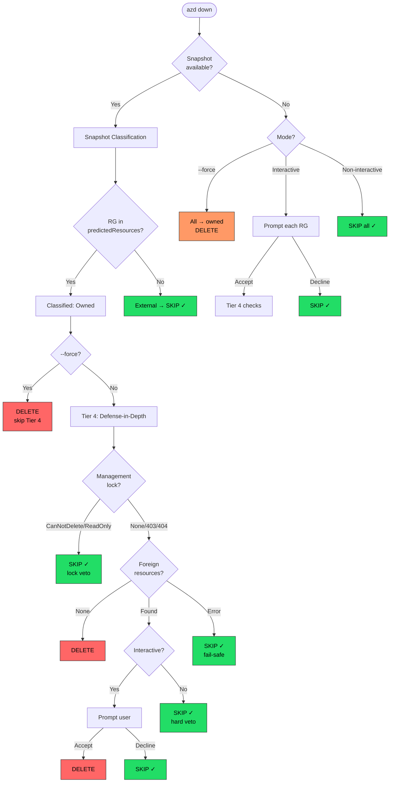

<!-- cspell:ignore azapi bicepparam subtests -->
# Architecture Design: Snapshot-Based Resource Group Safety for `azd down`

## Overview

### Problem Statement

`azd down` deletes pre-existing resource groups that were merely referenced (via
Bicep `existing` keyword) but not created by the deployment. This causes
catastrophic, unrecoverable data loss.

**Root cause**: `resourceGroupsFromDeployment()` in `standard_deployments.go`
extracts ALL resource groups from ARM's `outputResources` and `dependencies`
fields without distinguishing created-vs-referenced resources.
`DeleteSubscriptionDeployment()` then calls `DeleteResourceGroup()` on every
discovered RG indiscriminately.

**Real-world impact**: A user with a subscription-scoped Bicep template that
creates `rg-lego2` for Container Apps and references pre-existing `rg-lego-db`
(via `existing`) to assign a Cosmos DB role ran `azd down`. Both resource groups
were deleted — destroying a Cosmos DB account, PostgreSQL Flexible Server, role
assignments, and the resource group itself.

**Permission-dependent behavior**: With `Contributor` role, RG deletion may fail
(masking the bug). With `Owner` role, it succeeds silently.

### Scope

This design covers the `azd down` command's resource group deletion logic for
**Standard Deployments** (non-deployment-stacks), including **layered
provisioning** (multi-layer `azure.yaml` configurations).

**In scope**:
- `StandardDeployments.DeleteSubscriptionDeployment()` — subscription-scoped
- `StandardDeployments.DeleteResourceGroupDeployment()` — RG-scoped
- Layered provisioning (`infra.layers[]` in `azure.yaml`) — cross-layer
  resource group safety
- `ClassifyResourceGroups` pipeline

**Out of scope — Deployment Stacks**:
- `StackDeployments` (`stack_deployments.go`) is **not modified** by this design.
  Deployment stacks natively track managed vs unmanaged resources via ARM
  Deployment Stacks and already handle this correctly. When
  `FeatureDeploymentStacks` is enabled, the classification pipeline is
  bypassed entirely. This design exclusively targets the `StandardDeployments`
  code path, which is the default behavior for all azd users.

### Constraints

- **No deployment stacks dependency** — the fix must work with the default
  standard deployment path, not behind an alpha flag
- **Machine-independent** — must work when `azd up` runs on machine A and
  `azd down` runs on machine B
- **Graceful degradation** — must handle API failures, missing snapshot data,
  etc. without defaulting to "delete everything"
- **Backward compatible** — resources provisioned before this change must not
  become undeletable; the system must degrade gracefully for pre-existing
  deployments
- **No new Azure permissions** — must work within the same permission set
  currently required by `azd down`

## Architecture

### Design Principle: Fail Safe

Every failure mode is **"skip deletion"** — never "delete anyway." The only path
to deleting a resource group requires positive confirmation from the snapshot
classification with no vetoes from the defense-in-depth safeguards. The correct
failure direction for a destructive operation is "we didn't delete something we
could have" not "we deleted something we shouldn't have."

### Classification Approach: Bicep Snapshot

`bicep snapshot` produces a `predictedResources` list containing **only resources
the template will CREATE** — resources declared with the Bicep `existing` keyword
are excluded by design. This provides a deterministic, offline, zero-API-call
answer to the question "does this template own this resource group?"

| Aspect | Snapshot |
|--------|----------|
| Data source | Template intent (deterministic, compile-time) |
| API calls | 0 (offline, local bicep CLI) |
| Handles template changes | Reflects current template (not stale deploy history) |
| `existing` handling | Excluded by design |
| Nested modules | Normalized — all predicted resources flattened |
| Conditional resources | Evaluated with provided parameter values |

### Component Design

#### 1. ClassifyResourceGroups

**Location**: `cli/azd/pkg/azapi/resource_group_classifier.go`

**Responsibility**: Determines whether azd owns each resource group by consulting
the Bicep snapshot and running defense-in-depth safety checks.

```go
func ClassifyResourceGroups(
    ctx context.Context,
    rgNames []string,
    opts ClassifyOptions,
) (*ClassifyResult, error)
```

The classifier operates in two modes:

1. **Snapshot available** (`SnapshotPredictedRGs != nil`): RGs in the predicted
   set are owned; RGs absent are external. Tier 4 (locks + foreign resources)
   runs on all owned candidates as defense-in-depth.

2. **Snapshot unavailable** (`SnapshotPredictedRGs == nil`): Conservative guard:
   - `--force`: all RGs treated as owned (backward compat, zero API calls)
   - Interactive: user prompted per-RG ("snapshot unavailable — cannot verify
     ownership")
   - Non-interactive: all RGs skipped

#### 2. Restructured Destroy Flow

**Location**: `cli/azd/pkg/infra/provisioning/bicep/bicep_destroy.go`

The deletion loop has been moved out of `DeleteSubscriptionDeployment()` into
`BicepProvider.Destroy()`, which now orchestrates:

1. `compileBicep()` → template + parameters (existing)
2. `scopeForTemplate()` → deployment scope (existing)
3. `completedDeployments()` → find most recent deployment (existing)
4. `deployment.Resources()` → grouped resources (existing)
5. **`getSnapshotPredictedRGs()`** → set of RG names from `bicep snapshot`
6. **`classifyResourceGroups()`** → snapshot classification + Tier 4
7. Delete only owned RGs, skip external/unknown
8. Purge soft-deleted resources (Key Vault, etc.) in owned RGs only
9. `VoidSubscriptionDeploymentState()` only after all deletions succeed

### Data Flow

```
azd down
  │
  ├─ BicepProvider.Destroy()
  │    │
  │    ├─ CompletedDeployments() ─── find most recent deployment
  │    │
  │    ├─ deployment.Resources() ─── get all resources (existing behavior)
  │    │
  │    ├─ GroupByResourceGroup() ─── group resources by RG name
  │    │
  │    ├─ getSnapshotPredictedRGs()
  │    │    ├─ Invoke `bicep snapshot` on current template
  │    │    ├─ Extract RGs from predictedResources (type = Microsoft.Resources/resourceGroups)
  │    │    └─ Return lowercased RG name set (nil on any error → triggers guard)
  │    │
  │    ├─ ClassifyResourceGroups()
  │    │    │
  │    │    ├─ [Snapshot Path] ─── when SnapshotPredictedRGs is non-nil
  │    │    │    ├─ RG in predicted set? → classified "owned"
  │    │    │    ├─ RG NOT in predicted set? → classified "external" → SKIP
  │    │    │    └─ Tier 4 runs on owned candidates (defense-in-depth)
  │    │    │
  │    │    └─ [Snapshot Unavailable Guard]
  │    │         ├─ ForceMode? → all RGs owned (backward compat)
  │    │         ├─ Interactive? → prompt user per RG
  │    │         └─ Non-interactive? → skip all
  │    │
  │    ├─ Delete only "owned" RGs
  │    │    ├─ Purge soft-deleted resources (Key Vault, Cognitive, AppConfig)
  │    │    ├─ Delete resource group
  │    │    └─ Report skipped RGs to progress callback
  │    │
  │    └─ VoidSubscriptionDeploymentState() ─── only after all deletions succeed
  │
  └─ Done
```

### Classification Flow Diagram



## Key Decisions

### Decision 1: Bicep Snapshot as Primary Classification Signal

**Pattern**: Leverage compile-time intent over runtime history

**Why**: `bicep snapshot` → `predictedResources` provides the single best answer
to "does this template own this resource group?" It reflects the template's
*current intent* — resources declared with `existing` are excluded by design.
Unlike deployment operations (which reflect the *last deploy* and can be stale,
incomplete, or purged), the snapshot is deterministic, offline, and always
current.

**How it works**:
1. `getSnapshotPredictedRGs()` invokes `bicep snapshot` with the template and
   parameters
2. Filters `predictedResources` for `type == "Microsoft.Resources/resourceGroups"`
3. Returns a lowercased set of RG names
4. `nil` return signals snapshot failure → triggers conservative guard

**Edge cases handled**:
- Conditional RGs (`if (condition)`) — evaluated with provided parameters
- Nested modules — snapshot normalizes to a flat list
- ARM expression names (`rg-${env}`) — resolved to concrete values
- Case-insensitive comparison via `strings.EqualFold` / lowercased set

### Decision 2: `--force` Uses Snapshot (Deterministic, Zero API Calls)

**Pattern**: Minimal-overhead safety even in CI/CD automation

**Why**: `--force` is used in CI/CD pipelines where operators want teardown
without prompts. With snapshot available, classification is deterministic and
free — no extra API calls. External RGs identified by the snapshot are still
protected (skipped).

**Behavior**:
- **With snapshot**: Snapshot classifies RGs. Tier 4 is skipped (zero API calls,
  consistent with `--force` contract of no interactive checks).
- **Without snapshot**: All RGs treated as owned (backward compat). This is the
  only path where an external RG could be deleted — it requires *both* snapshot
  failure *and* explicit `--force`.

### Decision 3: Tier 4 Defense-in-Depth (Locks + Foreign Resources)

**Pattern**: Defense in depth / Fail safe

**Why**: Even when the snapshot says "owned," a management lock or foreign
resources should prevent deletion. Tier 4 catches edge cases the snapshot cannot:
user-added locks, resources deployed outside azd into an azd-owned RG, etc.

**Lock check (best-effort)**:
- `CanNotDelete` or `ReadOnly` lock → hard veto (skip deletion)
- 403 → no veto (best-effort: locks are additive protection; inability to read
  them does not imply the RG is unsafe to delete)
- 404 → no veto (RG already deleted)

**Foreign resource check (strict)**:
- Resources without matching `azd-env-name` tag → prompt if interactive, hard
  veto otherwise
- 403 → hard veto (cannot enumerate resources = cannot verify safety; unlike
  lock 403 where inability to read is benign, resource 403 means we lack
  visibility into what we'd delete)
- Extension resource types (roleAssignments, diagnosticSettings, resource links)
  → skipped (these commonly lack tags and are created by azd scaffold templates)

**Errors → veto**: Any unexpected error in Tier 4 is treated as a veto
(fail-safe). We log the error and skip deletion rather than risk destroying
unknown resources.

### Decision 4: Skip Classification When Deployment Stacks Active

Deployment stacks natively track managed vs unmanaged resources via ARM
Deployment Stacks. When `FeatureDeploymentStacks` is enabled, the snapshot
classification pipeline is bypassed entirely — ARM handles it correctly already.

### Decision 5: VoidState Only After Full Success

`VoidSubscriptionDeploymentState()` clears the deployment from ARM, destroying
the evidence needed for future classification. This MUST only happen after all
intended deletions succeed. On partial failure, the deployment state is preserved
so a subsequent `azd down` can retry.

## Layered Provisioning Support

### Background

azd supports **layered provisioning** where `azure.yaml` defines multiple
infrastructure layers under `infra.layers[]`. Each layer is a separate Bicep
module with its own ARM deployment. During `azd down`, layers are processed in
**reverse order** — the last layer provisioned is the first layer destroyed.

Each layer gets its own deployment name (`{envName}-{layerName}`), its own ARM
deployment with tags, and its own independent `Destroy()` cycle.

### Cross-Layer Resource Group Scenarios

The classification pipeline runs per-layer (each layer processes independently).
The snapshot for each layer reflects that layer's template.

**Scenario 1: Layer 1 creates RG, Layer 2 references it via `existing`**

Processing order: Layer 2 first, then Layer 1.

1. Layer 2 snapshot: RG not in `predictedResources` → external → **SKIP**
2. Layer 1 snapshot: RG in `predictedResources` → owned → **DELETE**

Result: Correct. The creating layer deletes the RG after the referencing layer.

**Scenario 2: Both layers reference a pre-existing RG**

1. Layer 2: not in snapshot → external → SKIP
2. Layer 1: not in snapshot → external → SKIP

Result: Correct. Pre-existing RG is preserved.

**Scenario 3: Layer 1 creates RG, Layer 2 deploys resources into it**

Layer 2 processes first and skips the RG (not in Layer 2's snapshot). When
Layer 1 processes, the RG contains resources from both layers. Tier 4's
foreign-resource check could find Layer 2's resources.

**Solution: `azd-env-name`-aware foreign resource check**

Tier 4's extra-resource check distinguishes truly foreign resources from
sibling-layer resources:

- For each resource in the RG: check its `azd-env-name` tag
- If tag matches current environment → sibling-layer resource → not foreign
- If tag missing or mismatched → truly foreign → triggers veto/prompt

This works because azd tags resources with `azd-env-name` during provisioning.
No pre-scan pass across layers is needed.

## Risks & Trade-offs

### Risk 1: Snapshot Unavailable

**When**: Older Bicep CLI without `snapshot` support, non-bicepparam mode,
snapshot errors.

**Impact**: Falls back to conservative guard (skip all in non-interactive,
prompt in interactive, all-owned in --force).

**Mitigation**: azd bundles Bicep 0.42.1+ which supports snapshot.
`generateBicepParam()` handles non-bicepparam case. Snapshot failure is
effectively unreachable in normal azd flows.

### Risk 2: Snapshot Excludes a Created RG (False Negative)

**When**: Bug in `bicep snapshot` implementation.

**Impact**: Medium — the created RG would not be deleted, requiring manual
cleanup.

**Mitigation**: This is the safe failure direction. Users can re-run with
`--force` if needed.

### Risk 3: Snapshot Includes an Existing RG (False Positive)

**When**: Bug in `bicep snapshot` where `existing` resources appear in
`predictedResources`.

**Impact**: High — would classify an external RG as owned.

**Mitigation**: Tier 4 defense-in-depth catches this: management locks block
deletion, and foreign-resource detection triggers a veto/prompt for resources
without matching `azd-env-name` tags.

### Risk 4: Backward Compatibility with Pre-Existing Deployments

**When**: User provisioned with older azd (no snapshot tag support), now runs
`azd down` with new azd.

**Impact**: None — snapshot is computed from the *current* template, not from
stored deployment state. If the template still exists locally, snapshot works.
If it doesn't, the snapshot-unavailable guard applies.

### Risk 5: Performance

**When**: `bicep snapshot` adds latency to `azd down`.

**Impact**: Low — snapshot runs locally (~1-3s), no Azure API calls.

**Mitigation**: The snapshot replaces what would have been API calls (deployment
operations, tag fetches). Net performance is likely better.

## Affected Files

### New Files
- `cli/azd/pkg/azapi/resource_group_classifier.go` — Snapshot classification +
  Tier 4 defense-in-depth (~460 lines)
- `cli/azd/pkg/azapi/resource_group_classifier_test.go` — 31 classifier subtests
- `cli/azd/pkg/infra/provisioning/bicep/bicep_destroy.go` — Snapshot extraction +
  classify-then-delete orchestrator (~520 lines)
- `cli/azd/pkg/infra/provisioning/bicep/bicep_destroy_test.go` — Destroy
  orchestrator tests

### Modified Files
- `cli/azd/pkg/azapi/deployments.go` — `VoidSubscriptionDeploymentState` method
- `cli/azd/pkg/azapi/standard_deployments.go` — Public `VoidSubscriptionDeploymentState`,
  `ResourceGroupsFromDeployment`
- `cli/azd/pkg/azapi/stack_deployments.go` — VoidState no-op stub
- `cli/azd/pkg/tools/bicep/bicep.go` — `Snapshot()` method + `SnapshotOptions`
  builder
- `cli/azd/pkg/infra/provisioning/bicep/bicep_provider.go` — Restructured
  `Destroy()` flow, snapshot override for testing
- `cli/azd/pkg/infra/provisioning/bicep/bicep_provider_test.go` — Integration
  tests
- `cli/azd/pkg/infra/provisioning/bicep/local_preflight.go` — Shared
  `snapshotResult` struct used by both preflight and destroy
- `cli/azd/pkg/infra/scope.go` — `VoidState` on Deployment interface
