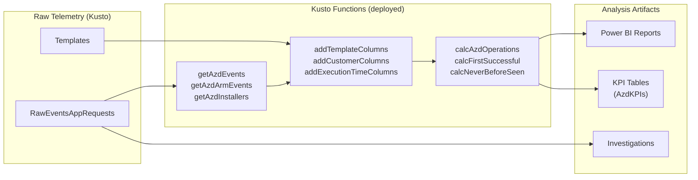

# Dashboards & Reports — azd Product Analysis Layer

> Reference for the Power BI reports, Kusto functions, and analysis tools built on azd telemetry.
>

## Overview

The analysis layer sits on top of raw telemetry data and provides dashboards, KPIs, and investigation tools. It lives in the [`azure-dev-tools`](https://github.com/coreai-microsoft/azure-dev-tools) repository under `product-telemetry/azd/`.

🔗 **Dashboard:** [aka.ms/azd/dashboard](https://aka.ms/azd/dashboard)

## How It Connects

## Kusto Functions

Deployed to **`DDAzureClients.DevCli`** under the `azd` folder via a [LENS job](https://lens.msftcloudes.com/#/job/24ce3f0fd3d6499ab8a0d85d0c0c05e2).

**Location:** `product-telemetry/azd/Kusto/Functions/`

### Naming Conventions

| Prefix | Purpose | Examples |
|--------|---------|----------|
| `get*` | Retrieves raw or filtered data | `getAzdEvents`, `getAzdArmEvents`, `getAzdInstallers` |
| `add*` | Enriches data with additional columns | `addTemplateColumns`, `addCustomerColumns`, `addExecutionTimeColumns` |
| `calc*` | Calculates metrics, aggregations, or KPIs | `calcAzdOperations`, `calcFirstSuccessfulExecution` |
| `flag*` | Adds boolean flags for filtering | `flagTestAzSubs` |

### Core Functions

#### Data Retrieval

| Function | Description | Key Parameters |
|----------|-------------|----------------|
| `getAzdEvents(...)` | Base query for all azd events. Filters `RawEventsAppRequests` by date range, local clients, daily builds, and minimum version. | `startDate`, `endDate`, `excludeLocalClients`, `excludeDailyBuilds`, `minVersion` |
| `getAzdArmEvents(...)` | ARM deployment-specific events | Same as `getAzdEvents` |
| `getAzdArmPreflightErrors(...)` | ARM preflight validation errors | Date range |
| `getAzdInstallers(...)` | Installation method data | Date range |
| `getAzdTemplatesByLanguage(...)` | Template usage by language | Date range |
| `getAzdCustomerDetails(...)` | Customer metadata enrichment | Date range |
| `getAzdCcids(...)` | Customer CIDs | Date range |
| `getAzdAzSubDetails(...)` | Azure subscription details | Date range |
| `getAzdMcpToolCalls_VSCode(...)` | MCP tool calls from VS Code | Date range |

#### Data Enrichment (`add*`)

| Function | What It Adds | Usage |
|----------|-------------|-------|
| `addTemplateColumns` | `TemplateName`, `TemplateRepo` — resolves hashed template IDs to names via `Templates` table | `\| invoke addTemplateColumns()` |
| `addTemplateName` | Just the template name (lighter weight) | `\| invoke addTemplateName()` |
| `addCustomerColumns` | Customer/organization details | `\| invoke addCustomerColumns()` |
| `addCustomerTpid` | Customer TPID (top-parent ID) | `\| invoke addCustomerTpid()` |
| `addCustomerAccountManager` | Account manager info | `\| invoke addCustomerAccountManager()` |
| `addAzSubColumns` | Azure subscription metadata | `\| invoke addAzSubColumns()` |
| `addExecutionTimeColumns` | `ExecutionTimeMs = DurationMs - perf.interact_time` | `\| invoke addExecutionTimeColumns()` |
| `addAzdAndArmErrorDetails` | Enriched error categorization for ARM errors | `\| invoke addAzdAndArmErrorDetails()` |

#### Calculations (`calc*`)

| Function | What It Calculates |
|----------|-------------------|
| `calcAzdOperations(...)` | Operation-level metrics (success rates, durations) |
| `calcAzdProvisionDurationByTemplate(...)` | Provision duration percentiles per template |
| `calcAzdDeploymentDurationByTemplate(...)` | Deployment duration percentiles per template |
| `calcAzdProvisionErrorsByTemplate(...)` | Top provision errors per template |
| `calcAzdDeploymentErrorsByTemplate(...)` | Top deployment errors per template |
| `calcAzdOperationDurationByTemplate(...)` | Overall operation duration per template |
| `calcAzdProvisionsByAzService(...)` | Provision counts by Azure service type |
| `calcAzdProvisionsByAzServiceAndTemplate(...)` | Provisions by service and template |
| `calcAzdProvisionsByAzService_FoundryAndAi(...)` | AI/Foundry-specific provision analysis |
| `calcDailyAzdProvisionsByTemplate(...)` | Daily provision counts per template |
| `calcDailyAzdDeploymentsByTemplate(...)` | Daily deployment counts per template |
| `calcFirstSuccessfulExecution(...)` | First successful execution per user/template |
| `calcFirstSuccessfulProvisionByServiceAndTemplate(...)` | First successful provision by service and template |
| `calcNeverBeforeSeenUsersForAzd(...)` | New users (never seen before) |
| `calcNeverBeforeSeenAzdDevDeviceIds(...)` | New devices |
| `calcNeverBeforeSeenAzdAzSubs(...)` | New Azure subscriptions |
| `calcNeverBeforeSeenAzdTemplates(...)` | New templates |

#### Utility

| Function | Purpose |
|----------|---------|
| `flagTestAzSubs` | Flags known test/internal Azure subscriptions |
| `getAllAzdTemplateNames` | Lists all known template names |
| `getAllAzServiceProvidersAndTypes` | Lists all Azure service providers and resource types |

### KPI Subfunctions

Additional functions under `Kusto/Functions/WeeklyKPIs/` and `Kusto/Functions/MonthlyKPIs/` compute periodic KPI rollups.

### Adding a New Function

1. Create a `.kql` file in `product-telemetry/azd/Kusto/Functions/`
2. Follow the naming convention (`get*`, `add*`, `calc*`, `flag*`)
3. Include a comment header explaining the function
4. Test in [Kusto Explorer](https://dataexplorer.azure.com/clusters/ddazureclients/databases/DevCli)
5. Submit a PR — the LENS job deploys after merge

## Power BI Reports

**Location:** `product-telemetry/azd/PowerBI/`

Reports are organized by topic area using PBIP (Power BI Project) format.

| Report Area | What It Covers |
|------------|----------------|
| **About** | Overview and documentation about the report suite |
| **KPIs** | Core KPI dashboards (MAU, MEU, MDU, success rates) |
| **Template KPIs** | Per-template adoption, success, and performance metrics |
| **Template Health** | Template error rates, failure patterns, top issues |
| **Deploy and Provision** | Deployment and provisioning operation analysis |
| **User Journeys** | User workflow patterns (init → provision → deploy funnels) |
| **Customer Exploration** | Customer-specific usage pattern exploration |
| **AI Foundry** | AI Foundry template usage and metrics |
| **Azure.AI.Agents** | Azure AI Agents telemetry |
| **MCP Tools** | Model Context Protocol tool usage |
| **On Demand Explorations** | Ad-hoc exploration reports |

### Adding or Updating Reports

1. Add your `.pbip` file to the appropriate subfolder in `PowerBI/`
2. For new categories, create a new folder with a descriptive name
3. Use deployed Kusto functions as data sources for maintainability
4. Add a README in the folder explaining the report's purpose

## KQL Query Library (azd-queries repo)

The [`azd-queries`](https://github.com/devdiv-azure-service-dmitryr/azd-queries) repo contains standalone KQL queries used for dashboards and analysis. These are separate from the deployed Kusto functions.

| Folder | What It Contains |
|--------|-----------------|
| `core-usage/` | MAU/MEU/MDU, funnels, retention, first-success, subscriptions |
| `insights-and-segments/` | Usage by language, template, installer, client, tenure, quota errors |
| `aspire/` | .NET Aspire-specific telemetry |
| `vscode/` | VS Code extension telemetry queries |
| `paas-retention/` | PaaS retention analysis |
| `cu-analysis/` | Consumption unit analysis |

## Investigations

**Location:** `product-telemetry/azd/Kusto/Investigations/`

Ad-hoc investigation queries for specific debugging scenarios or customer explorations. These are not deployed as functions but serve as reference for common investigation patterns.

## Reports

**Location:** `product-telemetry/azd/Reports/`

Written analysis documents:

| Report | Description |
|--------|-------------|
| `unknown-errors-report.md` | Analysis of unclassified errors in azd telemetry |
| `provision-errors-report.md` | Deep-dive into provision failure patterns |
| `azd-state-of-the-product-feb-2026.kqlx` | State of the product analysis |

## Funnel Metrics Framework

**Location:** `product-telemetry/azd/Kusto/funnel-metrics/`

A framework for defining and computing user funnels (e.g., init → provision → deploy). See `funnel-metrics/README.md` for the model and data sources.

## See Also

- [Architecture](../architecture/telemetry.md) — How telemetry flows end-to-end
- [Data Reference](telemetry-data.md) — Schema, events, fields, query patterns
- [Feature Telemetry Guide](../guides/feature-telemetry.md) — Adding telemetry to new features
- [Telemetry Overview](../guides/telemetry-overview.md) — For product managers and leadership
