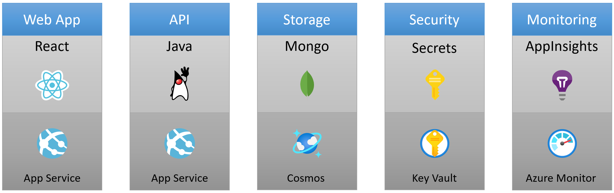
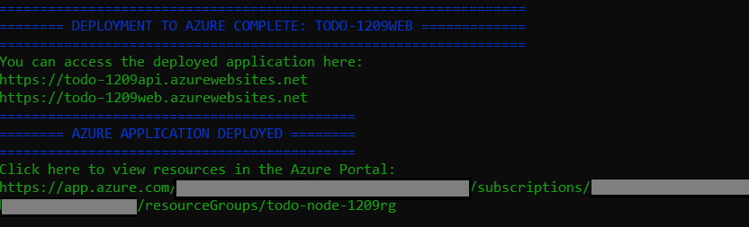

# To Do Application with Java and Cosmos DB (Mongo)

This repo contains a complete sample To Do application that demonstrates how to build an Azure solution using Java, Cosmos DB (Mongo) for storage, and Azure Monitor for monitoring and logging.

## ⛔ IMPORTANT

> ### Please keep all repositories and templates you create on GitHub.com *private*

## To Do Application

Here's the web frontend of this To Do application:


## Azure Resources

This application is comprised of the following Azure resources:

- Azure App Services - To host the To Do app website and API.
- Azure Cosmos DB with Mongo API - To store the To Do data in a Mongo API.
- Azure Key Vault - To securely store the Cosmos connection string used to connect the application API to the database.
- Azure Monitor - A cloud instrumentation service to help you monitor your application.



## Setup

To run this project, you first need to setup your local development environment and get the code.

> NOTE: Support for GitHub Codespaces and VS Code Remote Containers (DevContainers) is coming soon.

### Prerequisites

Please install the following prerequisites on your local machine.

1. Install [Git](https://git-scm.com/)
1. Install [GitHub CLI](https://github.com/cli/cli)
1. Install [Java 11 or above](https://www.microsoft.com/openjdk)
1. Install [Azure CLI (v 2.30.0+)](https://docs.microsoft.com/cli/azure/install-azure-cli)
1. Install Azure Dev CLI Extension

    This allows you to run all of the `az dev` commands that you will see below.

    Run this command to install it:

    ```bash
    az extension add --source https://azdevcliextstorage.blob.core.windows.net/whls/azure_dev-0.0.1-py2.py3-none-any.whl
    ```

### Project Folder

You will need an empty folder on your computer to house the project files.  

1. Open your favorite terminal, create a new folder, and set your current directory to that newly created folder.

    ```bash
    mkdir {your-unique-project-folder-name}
    cd {your-unique-project-folder-name}
    ```

### Code

Run the following command to get a local copy of this repository:

```bash
az dev init --template todo-java-mongo
```

Now that you have your environment setup, you are ready to continue.

## Quickstart

### Getting the application up and running in Azure

The fastest possible way for you to get this app up and running on Azure is to use the `az dev up` command. It will provision all the Azure resources and deploy the code you need to run the application.

Run the following command to provision, build, and deploy this application to Azure in a single step.

```bash
az dev up
```
>NOTE: This may take a while to complete as it performs both the `az dev provision` (creates Azure services) and `az dev deploy` (deploys code) steps.

This will print a URL to the To Do API application and a URL to the To Do web application. Click the web application URL to launch the To Do app.

Click the Azure Portal link to view resources provisioned.



### CI/CD

This template includes a GitHub Actions pipeline configuration file that will deploy your application whenever code is pushed to the main branch. You can find that pipeline file here: `.github/workflows`

Setting up this pipeline requires you to give GitHub permission to deploy to Azure on your behalf, which is done via a Service Principal. That information is stored in the `AZURE_CREDENTIALS` secrets/variables on GitHub.

The Azure Dev CLI contains a command (`az dev cicd`) that helps you get everything you need to configure a CI/CD pipeline.

Run the following command to setup CI/CD for GitHub

```bash
az dev cicd
```

You can view the GitHub action in your repo.

> GitHub -> Azure Open ID Connect (OIDC) is not yet supported.

### Run

Now that your Azure resources have been provisioned, and CI/CD pipeline is set up, you can edit the code, and run it locally. To see this in action, you will make a simple modification to the code.

1. Open `header.tsx` in `/src/web/src/layout`
1. Locate the line `<Text variant="xLarge">ToDo</Text>` and update **ToDo** to say **myTodo** to update the application label.
1. Save the file.

Now, run the following command to run the application locally:

```bash
az dev run
```

This will print a URL that you can click to launch the application. 

If everything looks good, commit your change and push to GitHub to automatically kick off the GitHub Action pipeline to deploy the update.

### Monitor

To help with monitoring applications, the Azure Dev CLI provides a `monitor` command to help you get to the various Application Insights dashboards.

#### Overview Dashboard

Run the following command to open the "Overview" dashboard:

```bash
az dev monitor --overview
```

#### Live Metrics Dashboard

Run the following command to open the "Live Metrics" dashboard:

```bash
az dev monitor --live
```

#### Logs Dashboard

Run the following command to open the "Logs" dashboard:

```bash
az dev monitor --logs
```

### Clean up

To delete your Azure resources for this project you can run the `az dev down` command:

```bash
az dev down
```

>NOTE: This may take a while to complete.

## Working with addtional az dev CLI commands

The following section will introduce you to additional `az dev` CLI commands that you can leverage.

### Provision

>NOTE: If you chose to run the `az dev up` command you can skip the `provision` and `deploy` command since `az dev up` performs both steps.

Before you can run this application, you will need to provision your resources to Azure.  

Run the following command to provision your Azure resources.

```bash
az dev provision
```

### Deploy

Run the following command to deploy the application to Azure:

```bash
az dev deploy
```

This will print a URL that you can click to launch the application.

### Test

The Azure Dev CLI includes sample tests so that you can quickly verify that the application is behaving as expected.

>NOTE: COMING SOON...

## Additional Resources

### Learn more about the Azure resources deployed in this solution
- [Azure App Services](https://docs.microsoft.com/azure/app-service/)
- [Azure Cosmos DB with Mongo API](https://docs.microsoft.com/azure/cosmos-db/mongodb/mongodb-introduction)
- [Azure Key Vault](https://docs.microsoft.com/azure/key-vault/)
- [Azure Monitor](https://docs.microsoft.com/azure/azure-monitor/)