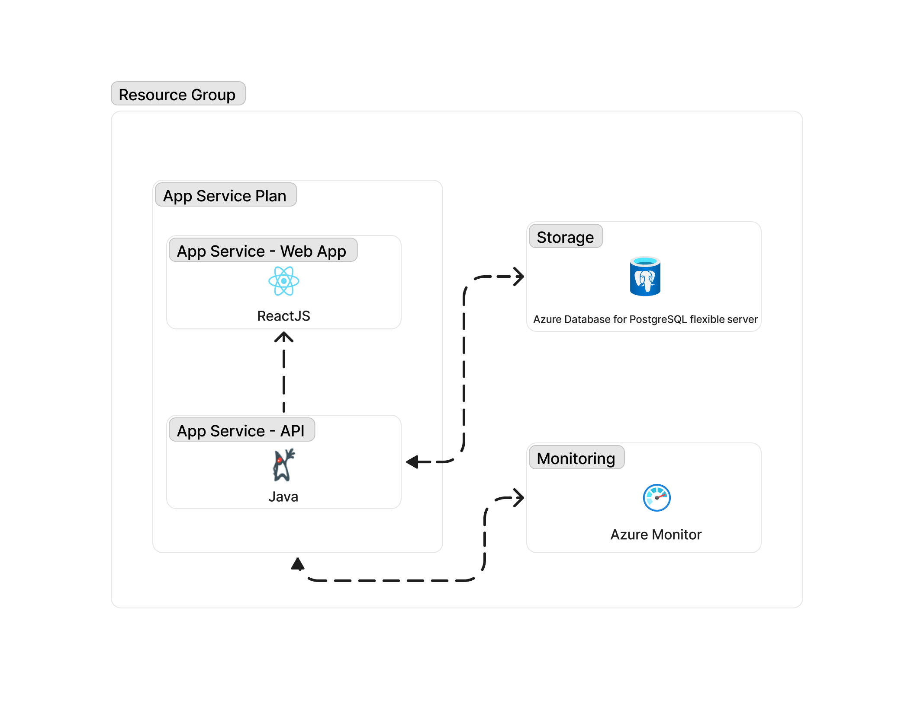

# React Web App with Java API and PostgreSQL on Azure

[](https://vscode.dev/redirect?url=vscode://ms-vscode-remote.remote-containers/cloneInVolume?url=https://github.com/Azure-Samples/todo-java-postgresql-terraform)

A blueprint for getting a React web app with a Java API and a PostgreSQL database on Azure. The blueprint includes sample application code (a ToDo web app) which can be removed and replaced with your own application code. Add your own source code and leverage the Infrastructure as Code assets (written in Bicep) to get up and running quickly.

Let's jump in and get this up and running in Azure. When you are finished, you will have a fully functional web app deployed to the cloud. In later steps, you'll see how to setup a pipeline and monitor the application.


<sup>Screenshot of the deployed ToDo app</sup>

### Prerequisites
> This template will create infrastructure and deploy code to Azure. If you don't have an Azure Subscription, you can sign up for a [free account here](https://azure.microsoft.com/free/). Make sure you have contributor role to the Azure subscription.

The following prerequisites are required to use this application. Please ensure that you have them all installed locally.

- [Azure Developer CLI](https://aka.ms/azd-install)
- [Java 17 or later](https://jdk.java.net/) - for API backend
- [Node.js with npm (18.17.1+)](https://nodejs.org/) - for Web frontend
- [Terraform](https://www.terraform.io/)
    - Requires the [Azure CLI](https://learn.microsoft.com/cli/azure/install-azure-cli)

### Quickstart
To learn how to get started with any template, follow the steps in [this quickstart](https://learn.microsoft.com/azure/developer/azure-developer-cli/get-started?tabs=localinstall&pivots=programming-language-java) with this template (`Azure-Samples/todo-java-postgresql-terraform`).

This quickstart will show you how to authenticate on Azure, initialize using a template, provision infrastructure and deploy code on Azure via the following commands:

```bash
# Log in to azd. Only required once per-install.
azd auth login

# First-time project setup. Initialize a project in the current directory, using this template. 
azd init --template Azure-Samples/todo-java-postgresql-terraform

# Provision and deploy to Azure
azd up
```

### Application Architecture

This application utilizes the following Azure resources:

- [**Azure App Services**](https://docs.microsoft.com/azure/app-service/) to host the Web frontend and API backend
- [**Azure Database for PostgreSQL - Flexible Server**](https://learn.microsoft.com/azure/postgresql/flexible-server/overview) for storage
- [**Azure Monitor**](https://docs.microsoft.com/azure/azure-monitor/) for monitoring and logging

Here's a high level architecture diagram that illustrates these components. Notice that these are all contained within a single [resource group](https://docs.microsoft.com/azure/azure-resource-manager/management/manage-resource-groups-portal), that will be created for you when you create the resources.



### Cost of provisioning and deploying this template
This template provisions resources to an Azure subscription that you will select upon provisioning them. Refer to the [Pricing calculator for Microsoft Azure](https://azure.microsoft.com/pricing/calculator/) to estimate the cost you might incur when this template is running on Azure and, if needed, update the included Azure resource definitions found in `infra/main.bicep` to suit your needs.

### Application Code

This template is structured to follow the [Azure Developer CLI](https://aka.ms/azure-dev/overview). You can learn more about `azd` architecture in [the official documentation](https://learn.microsoft.com/azure/developer/azure-developer-cli/make-azd-compatible?pivots=azd-create#understand-the-azd-architecture).

### Next Steps

At this point, you have a complete application deployed on Azure. But there is much more that the Azure Developer CLI can do. These next steps will introduce you to additional commands that will make creating applications on Azure much easier. Using the Azure Developer CLI, you can setup your pipelines, monitor your application, test and debug locally.

> Note: Needs to manually install [setup-azd extension](https://marketplace.visualstudio.com/items?itemName=ms-azuretools.azd) for Azure DevOps (azdo).

- [`azd pipeline config`](https://learn.microsoft.com/azure/developer/azure-developer-cli/configure-devops-pipeline?tabs=GitHub) - to configure a CI/CD pipeline (using GitHub Actions or Azure DevOps) to deploy your application whenever code is pushed to the main branch. 

- [`azd monitor`](https://learn.microsoft.com/azure/developer/azure-developer-cli/monitor-your-app) - to monitor the application and quickly navigate to the various Application Insights dashboards (e.g. overview, live metrics, logs)

- [Run and Debug Locally](https://learn.microsoft.com/azure/developer/azure-developer-cli/debug?pivots=ide-vs-code) - using Visual Studio Code and the Azure Developer CLI extension

- [`azd down`](https://learn.microsoft.com/azure/developer/azure-developer-cli/reference#azd-down) - to delete all the Azure resources created with this template 

### Additional `azd` commands

The Azure Developer CLI includes many other commands to help with your Azure development experience. You can view these commands at the terminal by running `azd help`. You can also view the full list of commands on our [Azure Developer CLI command](https://aka.ms/azure-dev/ref) page.

## Troubleshooting/Known issues

Sometimes, things go awry. If you happen to run into issues, then please review our ["Known Issues"](https://aka.ms/azure-dev/knownissues) page for help. If you continue to have issues, then please file an issue in our main [Azure Developer CLI](https://aka.ms/azure-dev/issues) repository.

### Error: creating Administrator

Please retry to resolve when you meet the below error:


## Security

### Roles

This template creates a [managed identity](https://docs.microsoft.com/azure/active-directory/managed-identities-azure-resources/overview) for your app inside your Azure Active Directory tenant, and it is used to authenticate your app with Azure and other services that support Azure AD authentication like PostgreSQL Flexible server via access policies. You will see principalId referenced in the infrastructure as code files, that refers to the id of the currently logged in Azure Developer CLI user, which will be granted access policies and permissions to run the application locally. To view your managed identity in the Azure Portal, follow these [steps](https://docs.microsoft.com/azure/active-directory/managed-identities-azure-resources/how-to-view-managed-identity-service-principal-portal).

## Reporting Issues and Feedback

If you have any feature requests, issues, or areas for improvement, please [file an issue](https://aka.ms/azure-dev/issues). To keep up-to-date, ask questions, or share suggestions, join our [GitHub Discussions](https://aka.ms/azure-dev/discussions). You may also contact us via AzDevTeam@microsoft.com.